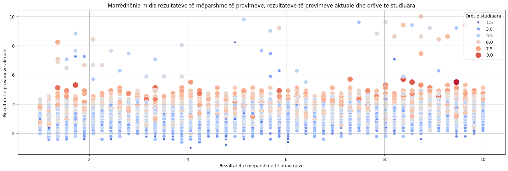
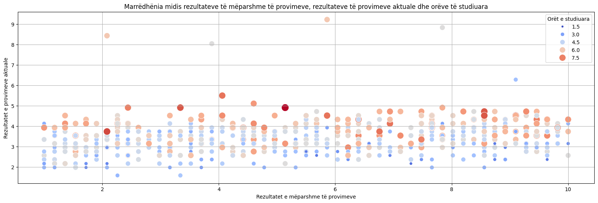
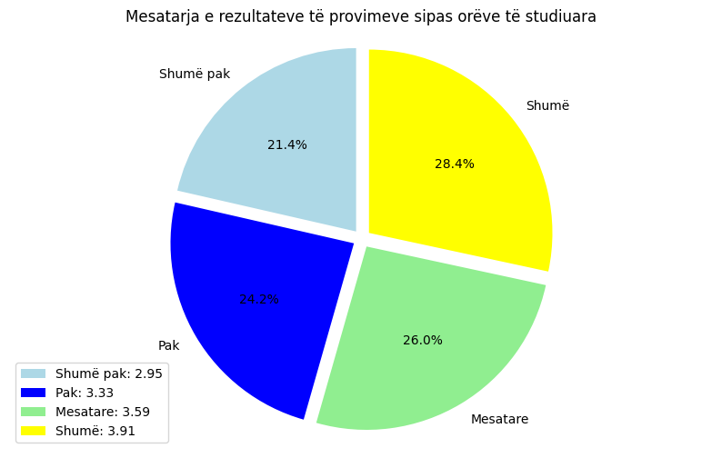
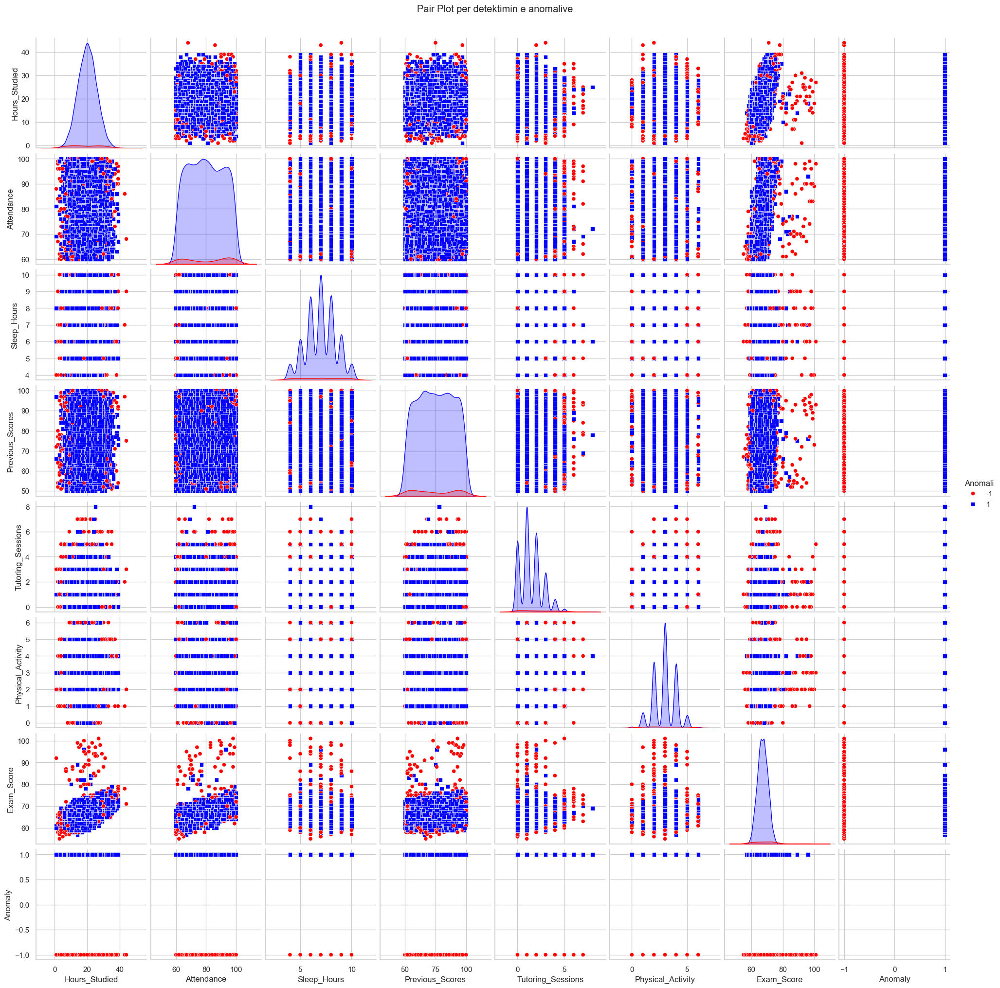
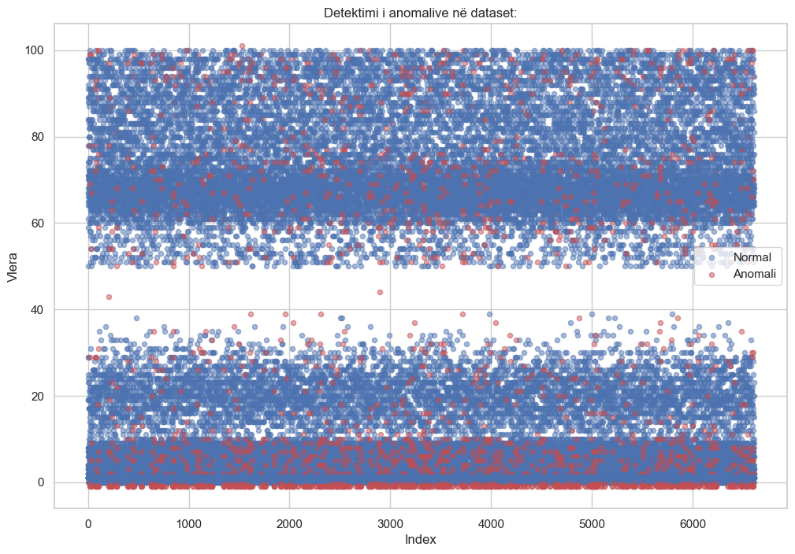

<div align="center">

### UNIVERSITETI I PRISHTINЁS  
### FAKULTETI I INXHINIERISË ELEKTRIKE DHE KOMPJUTERIKE  


### Lënda: Përgatitja dhe vizualizimi i të dhënave
### Projekti: Faktorët e performancës së studentëve
<div align="left"><h3>Mentor: Prof. Dr. Mërgim Hoti</h3></div>
<div align="left"><h3>Kontribuesit: Lirim Islami, Arbnor Puka, Enis Halilaj</h3></div>

</div>

# Faktorët e performancës së studentëve

Ky projekt është pjesë e lëndës **Përgatitja dhe Vizualizimi i të Dhënave** në kuadër të programit të studimeve Master IKS 2024/25. 
Projekti ynë ka për qëllim të analizojë dhe vizualizojë faktorët që ndikojnë në performancën akademike të studentëve duke përdorur teknika të përpunimit dhe vizualizimit të të dhënave.

Për të realizuar këtë projekt, kemi përdorur këtë dataset: **[Student Performance Factors](https://www.kaggle.com/datasets/lainguyn123/student-performance-factors)**

## Udhëzime në ekzekutimin e projektit
Për të ekzekutuar projektin në pajisjen tuaj, ndiqni këto hapa:

### 1. Kërkesat
Sigurohuni që të keni të instaluar **Python 3.6** ose versionin më të ri. Mund ta shkarkoni nga [python.org](https://www.python.org/downloads/).

### 2. Klonimi i projektit
Klononi projektin me komandën:
```bash
git clone https://github.com/enis-halilaj/pvdh-projekti-msc
```

### 3. Instalimi i paketave
Pasi të jeni në direktoriumin e projektit, instaloni paketat duke përdorur këtë komandë:
```bash
pip3 install -r requirements.txt
```


<h1>Faktorët e performancës së studentëve</h1>

<p>Qëllimi i preprocesimit të datasetit <b>Faktorët e performancës së studentëve</b> është të strukturojë dhe pastrojë të dhënat për të lehtësuar analizën e thellë të ndikimeve në performancën akademike të studentëve. Ky proces siguron që të dhënat të jenë të pastra, të organizuara, dhe të gatshme për të zbuluar lidhjet kyçe që influencojnë suksesin e studentëve. Përmes kësaj analize të dhënash të përpunuara, mund të identifikohen dhe zbatohen strategji të efektshme arsimore që ndihmojnë në përmirësimin e arritjeve të studentëve dhe në ngritjen e cilësisë së proceseve mësimore.</p>


<h3>Libraritë e përdorura</h3>


```python
import pandas as pd
import numpy as np
from scipy import stats
from scipy.stats import zscore
from IPython.display import display
from sklearn.preprocessing import MinMaxScaler, StandardScaler
import matplotlib.pyplot as plt
import seaborn as sns
from sklearn.ensemble import IsolationForest
```


<h3>Leximi i datasetit</h3>


```python
# Dataframe kryesor
main_df = pd.read_csv("../dataset/StudentPerformanceFactors.csv")

# Dataframe i preprocesuar
pre_df = pd.read_csv("../dataset/StudentPerformanceFactors_new.csv")
```

<h2>1. FAZA E PARË</h2>

<h3>Kualiteti i të dhënave</h3>

<h4>Struktura e datasetit </h4>

```python
display(main_df.head())
```
<div>

<table border="1" class="dataframe">
  <thead>
    <tr >
      <th></th>
      <th>Hours_Studied</th>
      <th>Attendance</th>
      <th>Parental_Involvement</th>
      <th>Access_to_Resources</th>
      <th>Extracurricular_Activities</th>
      <th>Sleep_Hours</th>
      <th>Previous_Scores</th>
      <th>Motivation_Level</th>
      <th>Internet_Access</th>
      <th>Tutoring_Sessions</th>
      <th>Family_Income</th>
      <th>Teacher_Quality</th>
      <th>School_Type</th>
      <th>Peer_Influence</th>
      <th>Physical_Activity</th>
      <th>Learning_Disabilities</th>
      <th>Parental_Education_Level</th>
      <th>Distance_from_Home</th>
      <th>Gender</th>
      <th>Exam_Score</th>
    </tr>
  </thead>
  <tbody>
    <tr>
      <th>0</th>
      <td>23</td>
      <td>84</td>
      <td>Low</td>
      <td>High</td>
      <td>No</td>
      <td>7</td>
      <td>73</td>
      <td>Low</td>
      <td>Yes</td>
      <td>0</td>
      <td>Low</td>
      <td>Medium</td>
      <td>Public</td>
      <td>Positive</td>
      <td>3</td>
      <td>No</td>
      <td>High School</td>
      <td>Near</td>
      <td>Male</td>
      <td>67</td>
    </tr>
    <tr>
      <th>1</th>
      <td>19</td>
      <td>64</td>
      <td>Low</td>
      <td>Medium</td>
      <td>No</td>
      <td>8</td>
      <td>59</td>
      <td>Low</td>
      <td>Yes</td>
      <td>2</td>
      <td>Medium</td>
      <td>Medium</td>
      <td>Public</td>
      <td>Negative</td>
      <td>4</td>
      <td>No</td>
      <td>College</td>
      <td>Moderate</td>
      <td>Female</td>
      <td>61</td>
    </tr>
    <tr>
      <th>2</th>
      <td>24</td>
      <td>98</td>
      <td>Medium</td>
      <td>Medium</td>
      <td>Yes</td>
      <td>7</td>
      <td>91</td>
      <td>Medium</td>
      <td>Yes</td>
      <td>2</td>
      <td>Medium</td>
      <td>Medium</td>
      <td>Public</td>
      <td>Neutral</td>
      <td>4</td>
      <td>No</td>
      <td>Postgraduate</td>
      <td>Near</td>
      <td>Male</td>
      <td>74</td>
    </tr>
    <tr>
      <th>3</th>
      <td>29</td>
      <td>89</td>
      <td>Low</td>
      <td>Medium</td>
      <td>Yes</td>
      <td>8</td>
      <td>98</td>
      <td>Medium</td>
      <td>Yes</td>
      <td>1</td>
      <td>Medium</td>
      <td>Medium</td>
      <td>Public</td>
      <td>Negative</td>
      <td>4</td>
      <td>No</td>
      <td>High School</td>
      <td>Moderate</td>
      <td>Male</td>
      <td>71</td>
    </tr>
    <tr>
      <th>4</th>
      <td>19</td>
      <td>92</td>
      <td>Medium</td>
      <td>Medium</td>
      <td>Yes</td>
      <td>6</td>
      <td>65</td>
      <td>Medium</td>
      <td>Yes</td>
      <td>3</td>
      <td>Medium</td>
      <td>High</td>
      <td>Public</td>
      <td>Neutral</td>
      <td>4</td>
      <td>No</td>
      <td>College</td>
      <td>Near</td>
      <td>Female</td>
      <td>70</td>
    </tr>
  </tbody>
</table>
</div>

<h4>Definimi i tipeve të të dhënave</h4>

```python
print("Tipet e të dhënave: \n")
print(main_df.dtypes)

# Atributet kategorike dhe numerike
categorical_columns = main_df.select_dtypes(include=['object']).columns
numerical_columns = main_df.select_dtypes(include=['int64', 'float64']).columns

print("\nAtributet kategorike:", list(categorical_columns))
print("\nAtributet numerike :", list(numerical_columns))
```

    Tipet e të dhënave: 
    
    Hours_Studied                  int64
    Attendance                     int64
    Parental_Involvement          object
    Access_to_Resources           object
    Extracurricular_Activities    object
    Sleep_Hours                    int64
    Previous_Scores                int64
    Motivation_Level              object
    Internet_Access               object
    Tutoring_Sessions              int64
    Family_Income                 object
    Teacher_Quality               object
    School_Type                   object
    Peer_Influence                object
    Physical_Activity              int64
    Learning_Disabilities         object
    Parental_Education_Level      object
    Distance_from_Home            object
    Gender                        object
    Exam_Score                     int64
    dtype: object
    
    Atributet kategorike: ['Parental_Involvement', 'Access_to_Resources', 'Extracurricular_Activities', 'Motivation_Level', 'Internet_Access', 'Family_Income', 'Teacher_Quality', 'School_Type', 'Peer_Influence', 'Learning_Disabilities', 'Parental_Education_Level', 'Distance_from_Home', 'Gender']
    
    Atributet numerike : ['Hours_Studied', 'Attendance', 'Sleep_Hours', 'Previous_Scores', 'Tutoring_Sessions', 'Physical_Activity', 'Exam_Score']


<h3>Detektimi dhe pastrimi nga noisy data</h3>


```python
# Zgjedhja e kolonave numerike
numerical_columns = pre_df.select_dtypes(include=['float64', 'int64']).columns.tolist()

# Llogaritja e Z-Score për çdo kolonë numerike për detektimin e noisy data
z_scores = np.abs(stats.zscore(pre_df[numerical_columns]))

# Vendosim pragun për të definuar se çfarë konsiderohet noisy (p.sh., Z-Score më i madh se 3)
threshold = 3
noisy_data_mask = (z_scores > threshold)

# Kontrollo dhe shfaq rreshtat që kanë vlera noisy
noisy_rows = pre_df[noisy_data_mask.any(axis=1)]
print(f"Numri i rreshtave me të dhëna noisy: {len(noisy_rows)}")
display(noisy_rows)

# Heqim rreshtat që kanë vlera noisy
pre_df_cleaned = pre_df[~noisy_data_mask.any(axis=1)]

# Shfaqim dataset-in e pastruar
print("Dataframe pas eliminimit të noisy data:")
display(pre_df_cleaned.head())
```

    Numri i rreshtave me të dhëna noisy: 51

<div>

<table border="1" class="dataframe">
  <thead>
    <tr >
      <th></th>
      <th>Hours_Studied</th>
      <th>Attendance</th>
      <th>Parental_Involvement</th>
      <th>Extracurricular_Activities</th>
      <th>Sleep_Hours</th>
      <th>Previous_Scores</th>
      <th>Motivation_Level</th>
      <th>Internet_Access</th>
      <th>Tutoring_Sessions</th>
      <th>Family_Income</th>
      <th>Teacher_Quality</th>
      <th>School_Type</th>
      <th>Peer_Influence</th>
      <th>Physical_Activity</th>
      <th>Learning_Disabilities</th>
      <th>Parental_Education_Level</th>
      <th>Distance_from_Home</th>
      <th>Gender</th>
      <th>Exam_Score</th>
    </tr>
  </thead>
  <tbody>
    <tr>
      <th>209</th>
      <td>43</td>
      <td>86</td>
      <td>High</td>
      <td>Yes</td>
      <td>7</td>
      <td>97</td>
      <td>Medium</td>
      <td>Yes</td>
      <td>2</td>
      <td>Medium</td>
      <td>High</td>
      <td>Public</td>
      <td>Positive</td>
      <td>1</td>
      <td>No</td>
      <td>High School</td>
      <td>Near</td>
      <td>Female</td>
      <td>78.0</td>
    </tr>
    <tr>
      <th>262</th>
      <td>1</td>
      <td>69</td>
      <td>High</td>
      <td>Yes</td>
      <td>6</td>
      <td>97</td>
      <td>Medium</td>
      <td>Yes</td>
      <td>1</td>
      <td>Low</td>
      <td>Medium</td>
      <td>Public</td>
      <td>Positive</td>
      <td>3</td>
      <td>No</td>
      <td>High School</td>
      <td>Near</td>
      <td>Female</td>
      <td>61.0</td>
    </tr>
    <tr>
      <th>478</th>
      <td>38</td>
      <td>86</td>
      <td>Low</td>
      <td>Yes</td>
      <td>7</td>
      <td>79</td>
      <td>Low</td>
      <td>Yes</td>
      <td>3</td>
      <td>Low</td>
      <td>Medium</td>
      <td>Public</td>
      <td>Negative</td>
      <td>3</td>
      <td>No</td>
      <td>High School</td>
      <td>Near</td>
      <td>Male</td>
      <td>73.0</td>
    </tr>
    <tr>
      <th>679</th>
      <td>28</td>
      <td>65</td>
      <td>Medium</td>
      <td>Yes</td>
      <td>4</td>
      <td>64</td>
      <td>Medium</td>
      <td>Yes</td>
      <td>6</td>
      <td>Medium</td>
      <td>High</td>
      <td>Public</td>
      <td>Neutral</td>
      <td>3</td>
      <td>No</td>
      <td>Postgraduate</td>
      <td>Near</td>
      <td>Male</td>
      <td>70.0</td>
    </tr>
    <tr>
      <th>724</th>
      <td>21</td>
      <td>73</td>
      <td>Medium</td>
      <td>No</td>
      <td>6</td>
      <td>85</td>
      <td>Medium</td>
      <td>Yes</td>
      <td>6</td>
      <td>Medium</td>
      <td>High</td>
      <td>Public</td>
      <td>Neutral</td>
      <td>5</td>
      <td>No</td>
      <td>College</td>
      <td>Near</td>
      <td>Male</td>
      <td>70.0</td>
    </tr>
    <tr>
      <th>1462</th>
      <td>19</td>
      <td>62</td>
      <td>High</td>
      <td>Yes</td>
      <td>6</td>
      <td>79</td>
      <td>Low</td>
      <td>Yes</td>
      <td>7</td>
      <td>Medium</td>
      <td>Medium</td>
      <td>Public</td>
      <td>Neutral</td>
      <td>2</td>
      <td>No</td>
      <td>High School</td>
      <td>Near</td>
      <td>Female</td>
      <td>66.0</td>
    </tr>
    <tr>
      <th>1548</th>
      <td>25</td>
      <td>95</td>
      <td>Low</td>
      <td>No</td>
      <td>7</td>
      <td>78</td>
      <td>Medium</td>
      <td>Yes</td>
      <td>7</td>
      <td>Low</td>
      <td>Medium</td>
      <td>Public</td>
      <td>Positive</td>
      <td>4</td>
      <td>No</td>
      <td>High School</td>
      <td>Near</td>
      <td>Male</td>
      <td>73.0</td>
    </tr>
    <tr>
      <th>1591</th>
      <td>2</td>
      <td>84</td>
      <td>Low</td>
      <td>No</td>
      <td>8</td>
      <td>54</td>
      <td>Low</td>
      <td>Yes</td>
      <td>3</td>
      <td>Low</td>
      <td>Low</td>
      <td>Public</td>
      <td>Positive</td>
      <td>4</td>
      <td>No</td>
      <td>High School</td>
      <td>Near</td>
      <td>Male</td>
      <td>62.0</td>
    </tr>
    <tr>
      <th>1615</th>
      <td>39</td>
      <td>95</td>
      <td>Medium</td>
      <td>Yes</td>
      <td>9</td>
      <td>54</td>
      <td>High</td>
      <td>Yes</td>
      <td>2</td>
      <td>Medium</td>
      <td>Medium</td>
      <td>Private</td>
      <td>Positive</td>
      <td>3</td>
      <td>No</td>
      <td>High School</td>
      <td>Moderate</td>
      <td>Male</td>
      <td>77.0</td>
    </tr>
    <tr>
      <th>1848</th>
      <td>26</td>
      <td>93</td>
      <td>High</td>
      <td>No</td>
      <td>6</td>
      <td>94</td>
      <td>Medium</td>
      <td>Yes</td>
      <td>6</td>
      <td>High</td>
      <td>Medium</td>
      <td>Private</td>
      <td>Negative</td>
      <td>4</td>
      <td>No</td>
      <td>High School</td>
      <td>Near</td>
      <td>Female</td>
      <td>74.0</td>
    </tr>
    <tr>
      <th>1957</th>
      <td>39</td>
      <td>97</td>
      <td>High</td>
      <td>Yes</td>
      <td>10</td>
      <td>91</td>
      <td>Medium</td>
      <td>Yes</td>
      <td>2</td>
      <td>Low</td>
      <td>Medium</td>
      <td>Public</td>
      <td>Positive</td>
      <td>3</td>
      <td>No</td>
      <td>High School</td>
      <td>Moderate</td>
      <td>Female</td>
      <td>79.0</td>
    </tr>
    <tr>
      <th>1971</th>
      <td>2</td>
      <td>96</td>
      <td>Low</td>
      <td>Yes</td>
      <td>9</td>
      <td>77</td>
      <td>Medium</td>
      <td>Yes</td>
      <td>3</td>
      <td>Medium</td>
      <td>Medium</td>
      <td>Public</td>
      <td>Neutral</td>
      <td>2</td>
      <td>No</td>
      <td>High School</td>
      <td>Far</td>
      <td>Female</td>
      <td>65.0</td>
    </tr>
    <tr>
      <th>2024</th>
      <td>2</td>
      <td>98</td>
      <td>Low</td>
      <td>Yes</td>
      <td>7</td>
      <td>80</td>
      <td>High</td>
      <td>Yes</td>
      <td>2</td>
      <td>Low</td>
      <td>High</td>
      <td>Public</td>
      <td>Neutral</td>
      <td>1</td>
      <td>No</td>
      <td>High School</td>
      <td>Near</td>
      <td>Male</td>
      <td>66.0</td>
    </tr>
    <tr>
      <th>2040</th>
      <td>16</td>
      <td>66</td>
      <td>Low</td>
      <td>No</td>
      <td>6</td>
      <td>93</td>
      <td>Medium</td>
      <td>Yes</td>
      <td>7</td>
      <td>Low</td>
      <td>Medium</td>
      <td>Public</td>
      <td>Negative</td>
      <td>2</td>
      <td>No</td>
      <td>High School</td>
      <td>Far</td>
      <td>Male</td>
      <td>63.0</td>
    </tr>
    <tr>
      <th>2198</th>
      <td>16</td>
      <td>92</td>
      <td>Medium</td>
      <td>Yes</td>
      <td>4</td>
      <td>90</td>
      <td>High</td>
      <td>Yes</td>
      <td>6</td>
      <td>High</td>
      <td>Medium</td>
      <td>Private</td>
      <td>Neutral</td>
      <td>3</td>
      <td>No</td>
      <td>High School</td>
      <td>Near</td>
      <td>Male</td>
      <td>72.0</td>
    </tr>
    <tr>
      <th>2231</th>
      <td>25</td>
      <td>72</td>
      <td>Low</td>
      <td>Yes</td>
      <td>6</td>
      <td>78</td>
      <td>Low</td>
      <td>Yes</td>
      <td>8</td>
      <td>Medium</td>
      <td>High</td>
      <td>Public</td>
      <td>Positive</td>
      <td>4</td>
      <td>No</td>
      <td>High School</td>
      <td>Near</td>
      <td>Male</td>
      <td>69.0</td>
    </tr>
    <tr>
      <th>2237</th>
      <td>14</td>
      <td>81</td>
      <td>Low</td>
      <td>No</td>
      <td>6</td>
      <td>89</td>
      <td>Medium</td>
      <td>No</td>
      <td>6</td>
      <td>Low</td>
      <td>High</td>
      <td>Private</td>
      <td>Neutral</td>
      <td>3</td>
      <td>No</td>
      <td>College</td>
      <td>Near</td>
      <td>Female</td>
      <td>67.0</td>
    </tr>
    <tr>
      <th>2265</th>
      <td>27</td>
      <td>97</td>
      <td>High</td>
      <td>No</td>
      <td>8</td>
      <td>72</td>
      <td>Medium</td>
      <td>Yes</td>
      <td>6</td>
      <td>Low</td>
      <td>Medium</td>
      <td>Public</td>
      <td>Neutral</td>
      <td>2</td>
      <td>No</td>
      <td>College</td>
      <td>Near</td>
      <td>Female</td>
      <td>76.0</td>
    </tr>
    <tr>
      <th>2305</th>
      <td>39</td>
      <td>92</td>
      <td>Medium</td>
      <td>No</td>
      <td>9</td>
      <td>73</td>
      <td>Medium</td>
      <td>Yes</td>
      <td>1</td>
      <td>Medium</td>
      <td>Medium</td>
      <td>Public</td>
      <td>Negative</td>
      <td>4</td>
      <td>No</td>
      <td>Postgraduate</td>
      <td>Moderate</td>
      <td>Male</td>
      <td>75.0</td>
    </tr>
    <tr>
      <th>2346</th>
      <td>17</td>
      <td>91</td>
      <td>High</td>
      <td>Yes</td>
      <td>10</td>
      <td>84</td>
      <td>Medium</td>
      <td>Yes</td>
      <td>7</td>
      <td>Low</td>
      <td>High</td>
      <td>Public</td>
      <td>Neutral</td>
      <td>4</td>
      <td>Yes</td>
      <td>College</td>
      <td>Moderate</td>
      <td>Male</td>
      <td>71.0</td>
    </tr>
    <tr>
      <th>2506</th>
      <td>38</td>
      <td>63</td>
      <td>Medium</td>
      <td>No</td>
      <td>8</td>
      <td>52</td>
      <td>High</td>
      <td>Yes</td>
      <td>1</td>
      <td>Medium</td>
      <td>Medium</td>
      <td>Private</td>
      <td>Positive</td>
      <td>3</td>
      <td>No</td>
      <td>College</td>
      <td>Moderate</td>
      <td>Male</td>
      <td>69.0</td>
    </tr>
    <tr>
      <th>2521</th>
      <td>38</td>
      <td>86</td>
      <td>High</td>
      <td>No</td>
      <td>6</td>
      <td>88</td>
      <td>High</td>
      <td>Yes</td>
      <td>1</td>
      <td>Low</td>
      <td>High</td>
      <td>Public</td>
      <td>Negative</td>
      <td>4</td>
      <td>No</td>
      <td>High School</td>
      <td>Moderate</td>
      <td>Female</td>
      <td>74.0</td>
    </tr>
    <tr>
      <th>2699</th>
      <td>28</td>
      <td>86</td>
      <td>Low</td>
      <td>No</td>
      <td>10</td>
      <td>85</td>
      <td>Medium</td>
      <td>Yes</td>
      <td>6</td>
      <td>Low</td>
      <td>High</td>
      <td>Public</td>
      <td>Neutral</td>
      <td>2</td>
      <td>No</td>
      <td>High School</td>
      <td>Near</td>
      <td>Male</td>
      <td>72.0</td>
    </tr>
    <tr>
      <th>2718</th>
      <td>16</td>
      <td>72</td>
      <td>High</td>
      <td>Yes</td>
      <td>9</td>
      <td>76</td>
      <td>High</td>
      <td>Yes</td>
      <td>6</td>
      <td>Low</td>
      <td>Low</td>
      <td>Public</td>
      <td>Negative</td>
      <td>3</td>
      <td>No</td>
      <td>High School</td>
      <td>Near</td>
      <td>Male</td>
      <td>67.0</td>
    </tr>
    <tr>
      <th>2895</th>
      <td>44</td>
      <td>68</td>
      <td>High</td>
      <td>No</td>
      <td>9</td>
      <td>75</td>
      <td>Low</td>
      <td>Yes</td>
      <td>3</td>
      <td>Medium</td>
      <td>High</td>
      <td>Private</td>
      <td>Negative</td>
      <td>2</td>
      <td>No</td>
      <td>High School</td>
      <td>Moderate</td>
      <td>Female</td>
      <td>71.0</td>
    </tr>
    <tr>
      <th>2947</th>
      <td>2</td>
      <td>67</td>
      <td>Medium</td>
      <td>No</td>
      <td>6</td>
      <td>73</td>
      <td>Low</td>
      <td>Yes</td>
      <td>1</td>
      <td>Low</td>
      <td>Medium</td>
      <td>Private</td>
      <td>Positive</td>
      <td>2</td>
      <td>No</td>
      <td>College</td>
      <td>Moderate</td>
      <td>Male</td>
      <td>58.0</td>
    </tr>
    <tr>
      <th>3388</th>
      <td>25</td>
      <td>94</td>
      <td>High</td>
      <td>No</td>
      <td>8</td>
      <td>96</td>
      <td>High</td>
      <td>Yes</td>
      <td>6</td>
      <td>Medium</td>
      <td>Medium</td>
      <td>Public</td>
      <td>Negative</td>
      <td>3</td>
      <td>Yes</td>
      <td>High School</td>
      <td>Far</td>
      <td>Female</td>
      <td>74.0</td>
    </tr>
    <tr>
      <th>3454</th>
      <td>2</td>
      <td>99</td>
      <td>Medium</td>
      <td>Yes</td>
      <td>9</td>
      <td>52</td>
      <td>Low</td>
      <td>Yes</td>
      <td>0</td>
      <td>Medium</td>
      <td>Medium</td>
      <td>Public</td>
      <td>Neutral</td>
      <td>4</td>
      <td>No</td>
      <td>High School</td>
      <td>Near</td>
      <td>Male</td>
      <td>62.0</td>
    </tr>
    <tr>
      <th>3617</th>
      <td>18</td>
      <td>95</td>
      <td>Medium</td>
      <td>Yes</td>
      <td>6</td>
      <td>94</td>
      <td>Medium</td>
      <td>Yes</td>
      <td>6</td>
      <td>Low</td>
      <td>High</td>
      <td>Public</td>
      <td>Neutral</td>
      <td>3</td>
      <td>No</td>
      <td>High School</td>
      <td>Far</td>
      <td>Female</td>
      <td>73.0</td>
    </tr>
    <tr>
      <th>3716</th>
      <td>39</td>
      <td>90</td>
      <td>High</td>
      <td>No</td>
      <td>8</td>
      <td>92</td>
      <td>High</td>
      <td>Yes</td>
      <td>2</td>
      <td>Medium</td>
      <td>High</td>
      <td>Private</td>
      <td>Neutral</td>
      <td>1</td>
      <td>No</td>
      <td>High School</td>
      <td>Near</td>
      <td>Female</td>
      <td>78.0</td>
    </tr>
    <tr>
      <th>3880</th>
      <td>22</td>
      <td>97</td>
      <td>High</td>
      <td>Yes</td>
      <td>5</td>
      <td>68</td>
      <td>Low</td>
      <td>Yes</td>
      <td>7</td>
      <td>Medium</td>
      <td>High</td>
      <td>Private</td>
      <td>Negative</td>
      <td>5</td>
      <td>No</td>
      <td>College</td>
      <td>Near</td>
      <td>Female</td>
      <td>75.0</td>
    </tr>
    <tr>
      <th>3894</th>
      <td>18</td>
      <td>72</td>
      <td>Low</td>
      <td>No</td>
      <td>7</td>
      <td>58</td>
      <td>Low</td>
      <td>Yes</td>
      <td>6</td>
      <td>Low</td>
      <td>Medium</td>
      <td>Public</td>
      <td>Positive</td>
      <td>0</td>
      <td>No</td>
      <td>High School</td>
      <td>Moderate</td>
      <td>Male</td>
      <td>64.0</td>
    </tr>
    <tr>
      <th>3982</th>
      <td>39</td>
      <td>75</td>
      <td>Medium</td>
      <td>Yes</td>
      <td>6</td>
      <td>82</td>
      <td>High</td>
      <td>Yes</td>
      <td>1</td>
      <td>High</td>
      <td>Low</td>
      <td>Public</td>
      <td>Negative</td>
      <td>3</td>
      <td>No</td>
      <td>College</td>
      <td>Near</td>
      <td>Male</td>
      <td>73.0</td>
    </tr>
    <tr>
      <th>4009</th>
      <td>24</td>
      <td>69</td>
      <td>High</td>
      <td>No</td>
      <td>7</td>
      <td>69</td>
      <td>Medium</td>
      <td>No</td>
      <td>7</td>
      <td>High</td>
      <td>Medium</td>
      <td>Public</td>
      <td>Positive</td>
      <td>3</td>
      <td>No</td>
      <td>College</td>
      <td>Near</td>
      <td>Female</td>
      <td>70.0</td>
    </tr>
    <tr>
      <th>4091</th>
      <td>29</td>
      <td>94</td>
      <td>High</td>
      <td>No</td>
      <td>7</td>
      <td>79</td>
      <td>Medium</td>
      <td>Yes</td>
      <td>6</td>
      <td>Low</td>
      <td>High</td>
      <td>Private</td>
      <td>Neutral</td>
      <td>4</td>
      <td>No</td>
      <td>College</td>
      <td>Near</td>
      <td>Female</td>
      <td>76.0</td>
    </tr>
    <tr>
      <th>4198</th>
      <td>2</td>
      <td>98</td>
      <td>High</td>
      <td>No</td>
      <td>4</td>
      <td>64</td>
      <td>Medium</td>
      <td>Yes</td>
      <td>1</td>
      <td>Low</td>
      <td>High</td>
      <td>Private</td>
      <td>Neutral</td>
      <td>2</td>
      <td>No</td>
      <td>High School</td>
      <td>Near</td>
      <td>Female</td>
      <td>65.0</td>
    </tr>
    <tr>
      <th>4247</th>
      <td>33</td>
      <td>92</td>
      <td>High</td>
      <td>Yes</td>
      <td>7</td>
      <td>67</td>
      <td>Low</td>
      <td>Yes</td>
      <td>6</td>
      <td>High</td>
      <td>Medium</td>
      <td>Public</td>
      <td>Positive</td>
      <td>5</td>
      <td>No</td>
      <td>High School</td>
      <td>Near</td>
      <td>Female</td>
      <td>78.0</td>
    </tr>
    <tr>
      <th>4697</th>
      <td>28</td>
      <td>99</td>
      <td>High</td>
      <td>No</td>
      <td>5</td>
      <td>100</td>
      <td>Medium</td>
      <td>Yes</td>
      <td>6</td>
      <td>Medium</td>
      <td>Medium</td>
      <td>Private</td>
      <td>Neutral</td>
      <td>5</td>
      <td>No</td>
      <td>High School</td>
      <td>Moderate</td>
      <td>Female</td>
      <td>76.0</td>
    </tr>
    <tr>
      <th>4725</th>
      <td>1</td>
      <td>81</td>
      <td>Medium</td>
      <td>Yes</td>
      <td>8</td>
      <td>66</td>
      <td>Medium</td>
      <td>Yes</td>
      <td>1</td>
      <td>Low</td>
      <td>Medium</td>
      <td>Public</td>
      <td>Negative</td>
      <td>2</td>
      <td>No</td>
      <td>College</td>
      <td>Near</td>
      <td>Male</td>
      <td>60.0</td>
    </tr>
    <tr>
      <th>4779</th>
      <td>1</td>
      <td>88</td>
      <td>Medium</td>
      <td>Yes</td>
      <td>4</td>
      <td>72</td>
      <td>High</td>
      <td>Yes</td>
      <td>3</td>
      <td>Medium</td>
      <td>Medium</td>
      <td>Private</td>
      <td>Negative</td>
      <td>2</td>
      <td>No</td>
      <td>College</td>
      <td>Near</td>
      <td>Male</td>
      <td>92.0</td>
    </tr>
    <tr>
      <th>4799</th>
      <td>24</td>
      <td>98</td>
      <td>Medium</td>
      <td>No</td>
      <td>8</td>
      <td>61</td>
      <td>Medium</td>
      <td>Yes</td>
      <td>6</td>
      <td>Medium</td>
      <td>High</td>
      <td>Private</td>
      <td>Positive</td>
      <td>3</td>
      <td>No</td>
      <td>High School</td>
      <td>Near</td>
      <td>Female</td>
      <td>75.0</td>
    </tr>
    <tr>
      <th>4870</th>
      <td>38</td>
      <td>90</td>
      <td>High</td>
      <td>Yes</td>
      <td>4</td>
      <td>60</td>
      <td>Low</td>
      <td>Yes</td>
      <td>2</td>
      <td>Low</td>
      <td>Medium</td>
      <td>Public</td>
      <td>Neutral</td>
      <td>4</td>
      <td>No</td>
      <td>College</td>
      <td>Moderate</td>
      <td>Male</td>
      <td>74.0</td>
    </tr>
    <tr>
      <th>4997</th>
      <td>39</td>
      <td>67</td>
      <td>High</td>
      <td>Yes</td>
      <td>5</td>
      <td>76</td>
      <td>Medium</td>
      <td>No</td>
      <td>2</td>
      <td>Medium</td>
      <td>Medium</td>
      <td>Private</td>
      <td>Negative</td>
      <td>4</td>
      <td>No</td>
      <td>High School</td>
      <td>Near</td>
      <td>Female</td>
      <td>71.0</td>
    </tr>
    <tr>
      <th>5157</th>
      <td>38</td>
      <td>82</td>
      <td>Medium</td>
      <td>No</td>
      <td>6</td>
      <td>97</td>
      <td>Low</td>
      <td>Yes</td>
      <td>2</td>
      <td>Low</td>
      <td>Medium</td>
      <td>Private</td>
      <td>Negative</td>
      <td>3</td>
      <td>No</td>
      <td>College</td>
      <td>Near</td>
      <td>Male</td>
      <td>72.0</td>
    </tr>
    <tr>
      <th>5224</th>
      <td>38</td>
      <td>80</td>
      <td>High</td>
      <td>No</td>
      <td>5</td>
      <td>78</td>
      <td>Medium</td>
      <td>Yes</td>
      <td>1</td>
      <td>Low</td>
      <td>Medium</td>
      <td>Public</td>
      <td>Positive</td>
      <td>4</td>
      <td>No</td>
      <td>College</td>
      <td>Far</td>
      <td>Female</td>
      <td>72.0</td>
    </tr>
    <tr>
      <th>5680</th>
      <td>14</td>
      <td>82</td>
      <td>Medium</td>
      <td>No</td>
      <td>6</td>
      <td>94</td>
      <td>Low</td>
      <td>Yes</td>
      <td>7</td>
      <td>Medium</td>
      <td>High</td>
      <td>Private</td>
      <td>Negative</td>
      <td>4</td>
      <td>No</td>
      <td>Postgraduate</td>
      <td>Near</td>
      <td>Male</td>
      <td>71.0</td>
    </tr>
    <tr>
      <th>5796</th>
      <td>39</td>
      <td>78</td>
      <td>Medium</td>
      <td>No</td>
      <td>6</td>
      <td>73</td>
      <td>Medium</td>
      <td>Yes</td>
      <td>0</td>
      <td>Low</td>
      <td>Medium</td>
      <td>Public</td>
      <td>Positive</td>
      <td>2</td>
      <td>No</td>
      <td>College</td>
      <td>Far</td>
      <td>Male</td>
      <td>70.0</td>
    </tr>
    <tr>
      <th>5846</th>
      <td>38</td>
      <td>98</td>
      <td>Low</td>
      <td>No</td>
      <td>6</td>
      <td>94</td>
      <td>Medium</td>
      <td>Yes</td>
      <td>2</td>
      <td>Low</td>
      <td>Low</td>
      <td>Public</td>
      <td>Negative</td>
      <td>4</td>
      <td>No</td>
      <td>Postgraduate</td>
      <td>Near</td>
      <td>Female</td>
      <td>75.0</td>
    </tr>
    <tr>
      <th>5855</th>
      <td>9</td>
      <td>64</td>
      <td>Medium</td>
      <td>Yes</td>
      <td>6</td>
      <td>99</td>
      <td>Medium</td>
      <td>Yes</td>
      <td>6</td>
      <td>Low</td>
      <td>High</td>
      <td>Public</td>
      <td>Positive</td>
      <td>6</td>
      <td>Yes</td>
      <td>High School</td>
      <td>Moderate</td>
      <td>Male</td>
      <td>65.0</td>
    </tr>
    <tr>
      <th>6061</th>
      <td>24</td>
      <td>67</td>
      <td>High</td>
      <td>No</td>
      <td>6</td>
      <td>86</td>
      <td>Medium</td>
      <td>Yes</td>
      <td>6</td>
      <td>Low</td>
      <td>Medium</td>
      <td>Private</td>
      <td>Positive</td>
      <td>3</td>
      <td>Yes</td>
      <td>Postgraduate</td>
      <td>Moderate</td>
      <td>Female</td>
      <td>67.0</td>
    </tr>
    <tr>
      <th>6485</th>
      <td>35</td>
      <td>84</td>
      <td>Low</td>
      <td>Yes</td>
      <td>8</td>
      <td>92</td>
      <td>High</td>
      <td>Yes</td>
      <td>6</td>
      <td>Low</td>
      <td>High</td>
      <td>Public</td>
      <td>Negative</td>
      <td>4</td>
      <td>No</td>
      <td>High School</td>
      <td>Moderate</td>
      <td>Male</td>
      <td>74.0</td>
    </tr>
  </tbody>
</table>
</div>


    Dataframe pas eliminimit të noisy data:


<div>

<table border="1" class="dataframe">
  <thead>
    <tr >
      <th></th>
      <th>Hours_Studied</th>
      <th>Attendance</th>
      <th>Parental_Involvement</th>
      <th>Extracurricular_Activities</th>
      <th>Sleep_Hours</th>
      <th>Previous_Scores</th>
      <th>Motivation_Level</th>
      <th>Internet_Access</th>
      <th>Tutoring_Sessions</th>
      <th>Family_Income</th>
      <th>Teacher_Quality</th>
      <th>School_Type</th>
      <th>Peer_Influence</th>
      <th>Physical_Activity</th>
      <th>Learning_Disabilities</th>
      <th>Parental_Education_Level</th>
      <th>Distance_from_Home</th>
      <th>Gender</th>
      <th>Exam_Score</th>
    </tr>
  </thead>
  <tbody>
    <tr>
      <th>0</th>
      <td>23</td>
      <td>84</td>
      <td>Low</td>
      <td>No</td>
      <td>7</td>
      <td>73</td>
      <td>Low</td>
      <td>Yes</td>
      <td>0</td>
      <td>Low</td>
      <td>Medium</td>
      <td>Public</td>
      <td>Positive</td>
      <td>3</td>
      <td>No</td>
      <td>High School</td>
      <td>Near</td>
      <td>Male</td>
      <td>67.0</td>
    </tr>
    <tr>
      <th>1</th>
      <td>19</td>
      <td>64</td>
      <td>Low</td>
      <td>No</td>
      <td>8</td>
      <td>59</td>
      <td>Low</td>
      <td>Yes</td>
      <td>2</td>
      <td>Medium</td>
      <td>Medium</td>
      <td>Public</td>
      <td>Negative</td>
      <td>4</td>
      <td>No</td>
      <td>College</td>
      <td>Moderate</td>
      <td>Female</td>
      <td>61.0</td>
    </tr>
    <tr>
      <th>2</th>
      <td>24</td>
      <td>98</td>
      <td>Medium</td>
      <td>Yes</td>
      <td>7</td>
      <td>91</td>
      <td>Medium</td>
      <td>Yes</td>
      <td>2</td>
      <td>Medium</td>
      <td>Medium</td>
      <td>Public</td>
      <td>Neutral</td>
      <td>4</td>
      <td>No</td>
      <td>Postgraduate</td>
      <td>Near</td>
      <td>Male</td>
      <td>74.0</td>
    </tr>
    <tr>
      <th>3</th>
      <td>29</td>
      <td>89</td>
      <td>Low</td>
      <td>Yes</td>
      <td>8</td>
      <td>98</td>
      <td>Medium</td>
      <td>Yes</td>
      <td>1</td>
      <td>Medium</td>
      <td>Medium</td>
      <td>Public</td>
      <td>Negative</td>
      <td>4</td>
      <td>No</td>
      <td>High School</td>
      <td>Moderate</td>
      <td>Male</td>
      <td>71.0</td>
    </tr>
    <tr>
      <th>4</th>
      <td>19</td>
      <td>92</td>
      <td>Medium</td>
      <td>Yes</td>
      <td>6</td>
      <td>65</td>
      <td>Medium</td>
      <td>Yes</td>
      <td>3</td>
      <td>Medium</td>
      <td>High</td>
      <td>Public</td>
      <td>Neutral</td>
      <td>4</td>
      <td>No</td>
      <td>College</td>
      <td>Near</td>
      <td>Female</td>
      <td>70.0</td>
    </tr>
  </tbody>
</table>
</div>

<h3>Detektimi dhe pastrimi i outliers</h3>

```python
# Zgjedh vetëm kolonat numerike për zbulimin e outliers
numerical_data = main_df.select_dtypes(include=['int64', 'float64'])

# Llogarit Z-Score
z_scores = np.abs(zscore(numerical_data))
threshold = 3  # Kufiri bazë për zbulimin e outliers

# Identifikon rreshtat me Z-Score më të madhe se kufiri
outliers = (z_scores > threshold).any(axis=1)

# Numëron sa outliers u identifikuan
num_outliers = outliers.sum()
print(f"Numri i outliers që janë identifikuar: {num_outliers}")

# Eleminon outliers nga dataseti origjinal
pre_df = main_df[~outliers]

# Visualizimi i shpërndarjes së të dhënave numerike dhe identifikimi i outliers me anë të Boxplot
plt.figure(figsize=(12, 6))
sns.boxplot(data=numerical_data)
plt.title('Box Plot i të dhënave numerike me outliers')
plt.show()

```

    Numri i outliers që janë identifikuar: 101

    

    

<h4>Menaxhimi vlerave të zbrazëta (null):</h4>

```python
# Metoda për gjetjen e vlerave null
null_counts = pre_df.isnull().sum()

print(null_counts)
has_nulls = pre_df.isnull().any()

print('\nAtributet që kanë vlera të zbrazëta (null):', ', '.join(has_nulls[has_nulls].index))
```

    Hours_Studied                 0
    Attendance                    0
    Parental_Involvement          0
    Access_to_Resources           0
    Extracurricular_Activities    0
    Sleep_Hours                   0
    Previous_Scores               0
    Motivation_Level              0
    Internet_Access               0
    Tutoring_Sessions             0
    Family_Income                 0
    Teacher_Quality               0
    School_Type                   0
    Peer_Influence                0
    Physical_Activity             0
    Learning_Disabilities         0
    Parental_Education_Level      0
    Distance_from_Home            0
    Gender                        0
    Exam_Score                    0
    dtype: int64
    
    Atributet që kanë vlera të zbrazëta (null): 


<p>Në kodin më poshtë, kemi përpunuar të dhënat duke zëvëndësuar vlerat null me vlera të përshtatshme në varësi të tipit të atributit (kolonës). Fillimisht kemi bërë identifikimin e kolonave me vlera të zbrazëta të cilat ndahen në dy grupe: numerike dhe kategorike. Kolonat numerike zëvëndësohen me medianën për të shmangur ndikimin e outliers, ndërsa kolona të tjera numerike përdorin mesataren. Për kolonat kategorike, vlerat null zëvëndesohen me vlerën më të shpeshtë. Pas kësaj kontrollohet dataset-i për të siguruar që të gjitha vlerat <b>null</b> janë zëvëndësuar duke lejuar modifikimin direkt të të dhënave me <b>inplace=True</b> dhe duke parandaluar kopjet e padëshiruara.</p>

```python
# Ndarja e kolonave në numerike dhe kategorike
numeric_cols = pre_df.select_dtypes(include=['float64', 'int64']).columns
categorical_cols = pre_df.select_dtypes(include=['object', 'category']).columns

# Për kolonat numerike vendos medianen si vlerë në Exam_Score
pre_df.fillna({'Exam_Score': pre_df['Exam_Score'].median()}, inplace=True)

# Vendos vlerën mesatare në kolonat e tjera numerike
for col in numeric_cols:
    if col != 'Exam_Score':
        pre_df.fillna({col: pre_df[col].mean()}, inplace=True)

# Për kolonat kategorike plotëso vlerat e zbrazëta me vlerën më të shpeshtë
for col in categorical_cols:
    pre_df.fillna({col: pre_df[col].mode()[0]}, inplace=True)

# Kontrollo përsëri për vlerat e zbrazëta për të konfirmuar
print("Atributet që kanë vlera null:")
print(pre_df.isnull().sum())

```

    Atributet që kanë vlera null:
    Hours_Studied                 0
    Attendance                    0
    Parental_Involvement          0
    Access_to_Resources           0
    Extracurricular_Activities    0
    Sleep_Hours                   0
    Previous_Scores               0
    Motivation_Level              0
    Internet_Access               0
    Tutoring_Sessions             0
    Family_Income                 0
    Teacher_Quality               0
    School_Type                   0
    Peer_Influence                0
    Physical_Activity             0
    Learning_Disabilities         0
    Parental_Education_Level      0
    Distance_from_Home            0
    Gender                        0
    Exam_Score                    0
    dtype: int64


    C:\Users\Lirim Islami\AppData\Local\Temp\ipykernel_15668\792950414.py:6: SettingWithCopyWarning: 
    A value is trying to be set on a copy of a slice from a DataFrame
    
    See the caveats in the documentation: https://pandas.pydata.org/pandas-docs/stable/user_guide/indexing.html#returning-a-view-versus-a-copy
      pre_df.fillna({'Exam_Score': pre_df['Exam_Score'].median()}, inplace=True)
    C:\Users\Lirim Islami\AppData\Local\Temp\ipykernel_15668\792950414.py:11: SettingWithCopyWarning: 
    A value is trying to be set on a copy of a slice from a DataFrame
    
    See the caveats in the documentation: https://pandas.pydata.org/pandas-docs/stable/user_guide/indexing.html#returning-a-view-versus-a-copy
      pre_df.fillna({col: pre_df[col].mean()}, inplace=True)
    C:\Users\Lirim Islami\AppData\Local\Temp\ipykernel_15668\792950414.py:15: SettingWithCopyWarning: 
    A value is trying to be set on a copy of a slice from a DataFrame
    
    See the caveats in the documentation: https://pandas.pydata.org/pandas-docs/stable/user_guide/indexing.html#returning-a-view-versus-a-copy
      pre_df.fillna({col: pre_df[col].mode()[0]}, inplace=True)


```python
# Lista e kolonave që duhet kontrolluar për vlera të zbrazëta
columns = [
    'Hours_Studied', 
    'Attendance', 
    'Parental_Involvement', 
    # 'Access_to_Resources', 
    'Extracurricular_Activities', 
    'Sleep_Hours', 
    'Previous_Scores', 
    'Motivation_Level', 
    'Internet_Access', 
    'Tutoring_Sessions', 
    'Family_Income', 
    'Teacher_Quality', 
    'School_Type', 
    'Peer_Influence', 
    'Physical_Activity', 
    'Learning_Disabilities', 
    'Parental_Education_Level', 
    'Distance_from_Home', 
    'Gender', 
    'Exam_Score'
]

# Largo rreshtat me vlera null në kolonat e specifikuara më lartë
pre_df.dropna(subset=columns, inplace=True)

# Shfaqni numrin e vlerave null që kanë mbetur në çdo kolonë
print(pre_df.isnull().sum())

```

    Hours_Studied                 0
    Attendance                    0
    Parental_Involvement          0
    Access_to_Resources           0
    Extracurricular_Activities    0
    Sleep_Hours                   0
    Previous_Scores               0
    Motivation_Level              0
    Internet_Access               0
    Tutoring_Sessions             0
    Family_Income                 0
    Teacher_Quality               0
    School_Type                   0
    Peer_Influence                0
    Physical_Activity             0
    Learning_Disabilities         0
    Parental_Education_Level      0
    Distance_from_Home            0
    Gender                        0
    Exam_Score                    0
    dtype: int64


    C:\Users\Lirim Islami\AppData\Local\Temp\ipykernel_15668\2461744827.py:26: SettingWithCopyWarning: 
    A value is trying to be set on a copy of a slice from a DataFrame
    
    See the caveats in the documentation: https://pandas.pydata.org/pandas-docs/stable/user_guide/indexing.html#returning-a-view-versus-a-copy
      pre_df.dropna(subset=columns, inplace=True)

<h4>Identifikimi i duplikimeve (duplicates)</h4>

```python
# Komanda për identifikimin e duplikimeve
print("Duplikimet e gjetura: " + str(pre_df.duplicated().sum()))
```

    Duplikimet e gjetura: 0

<p>Në dataset-in tonë nuk kemi gjetur ndonjë duplikat prandaj nuk ishte e nevojshme të bëjme asnjë fshirje të duplikateve. Kjo konfirmon kualitetin e të dhënave dhe na lejon të vazhdojmë me analizën e mëtejme.</p>


<h3>Agregimi i të dhënave</h3>

```python
# Agregimi sipas 'Parental_Involvement' dhe 'Internet_Access' për të vlerësuar ndikimin e tyre në 'Previous_Scores'.
# Ky agregim na ndihmon të kuptojmë se si mbështetja nga prindërit dhe qasja në internet ndikojnë në rezultatet e provimeve të nxënësve.
avg_previous_scores_by_parental_involvement_and_internet = pre_df.groupby(['Parental_Involvement', 'Internet_Access']).agg({
    'Exam_Score': 'mean'
}).round(2)

# Agregimi sipas 'School_Type' dhe 'Teacher_Quality' për të vlerësuar ndikimin e tyre në 'Hours_Studied'.
#Ky agregim shqyrton se si mjedisi arsimor dhe cilësia e mësimit ndikojnë në sasinë e kohës që studentët dedikojnë për studime.
avg_hours_studied_by_school_and_teacher = pre_df.groupby(['School_Type', 'Teacher_Quality']).agg({
    'Hours_Studied': 'mean'
}).round(2)

print("Mesatarja e rezultateve të mëparshme sipas përfshirjes së prindërve dhe çasjes në internet:")
print(avg_previous_scores_by_parental_involvement_and_internet)

print("Mesatarja e orëve të studiuara sipas llojit të shkollës dhe cilësisë së mësuesit:")
print(avg_hours_studied_by_school_and_teacher)
```

    Mesatarja e rezultateve të mëparshme sipas përfshirjes së prindërve dhe çasjes në internet:
                                          Exam_Score
    Parental_Involvement Internet_Access            
    High                 No                    66.72
                         Yes                   67.93
    Low                  No                    65.61
                         Yes                   66.18
    Medium               No                    66.32
                         Yes                   67.01
    Mesatarja e orëve të studiuara sipas llojit të shkollës dhe cilësisë së mësuesit:
                                 Hours_Studied
    School_Type Teacher_Quality               
    Private     High                     19.76
                Low                      20.13
                Medium                   20.01
    Public      High                     19.96
                Low                      19.84
                Medium                   19.96


```python
# Agregimi sipas pjesëmarrjes në aktivitete jashtëkurrikulare dhe ndikimi i tyre në orët e gjumit dhe rezultatet e provimeve
# Vlerësojmë nëse angazhimi në aktivitete jashtëkurrikulare ka ndërlidhje me performancë më të mirë në provime dhe si ndikon në orët e gjumit.
avg_scores_sleep_by_activities = pre_df.groupby('Extracurricular_Activities').agg({
    'Exam_Score': 'mean',
    'Sleep_Hours': 'mean'
}).round(2)

# Agregimi sipas 'Teacher_Quality' dhe 'Distance_from_Home' për të vlerësuar ndikimin e tyre në 'Attendance'.
# Ky agregim ndihmon në identifikimin e ndërveprimeve mes faktorëve arsimorë dhe logjistikë që mund të ndikojnë në frekuencën e pranisë së studentëve në shkollë.
avg_attendance_by_teacher_quality_and_distance = pre_df.groupby(['Teacher_Quality', 'Distance_from_Home']).agg({
    'Attendance': 'mean'
}).round(2)

print("\nMesatarja e rezultateve të provimeve dhe orëve të gjumit sipas pjesëmarrjes në aktivitete jashtëkurrikulare: ")
print(avg_scores_sleep_by_activities)

print("Mesatarja e Pjesëmarrjes sipas cilësisë së mësuesit dhe distanca nga shtëpia: ")
print(avg_attendance_by_teacher_quality_and_distance)
```

    Mesatarja e rezultateve të provimeve dhe orëve të gjumit sipas pjesëmarrjes në aktivitete jashtëkurrikulare: 
                                Exam_Score  Sleep_Hours
    Extracurricular_Activities                         
    No                               66.76         7.03
    Yes                              67.23         7.03
    Mesatarja e Pjesëmarrjes sipas cilësisë së mësuesit dhe distanca nga shtëpia: 
                                        Attendance
    Teacher_Quality Distance_from_Home            
    High            Far                      79.68
                    Moderate                 79.67
                    Near                     80.19
    Low             Far                      78.47
                    Moderate                 80.17
                    Near                     80.50
    Medium          Far                      79.42
                    Moderate                 79.92
                    Near                     79.98


<h3>Mostrimi i të dhënave</h3>
<p>Mostrimi i të dhënave është procesi i zgjedhjes së një numri të vogël të elementeve nga një grup më i madh për të kryer analiza më të shpejta dhe më ekonomike, pa pasur nevojë të shikojmë të gjitha të dhënat</p>

```python
# Vizualizimi i marrëdhënies midis Previous Scores, Exam Score dhe Hours Studied pa mostrim

plt.figure(figsize=(20, 6))
scatter = sns.scatterplot(data=pre_df, x='Previous_Scores', y='Exam_Score', hue='Hours_Studied', palette='coolwarm', size='Hours_Studied', sizes=(20, 200))
plt.title('Marrëdhënia midis rezultateve të mëparshme të provimeve, rezultateve të provimeve aktuale dhe orëve të studiuara')
plt.xlabel('Rezultatet e mëparshme të provimeve')
plt.ylabel('Rezultatet e provimeve aktuale')
plt.legend(title='Orët e studiuara')
plt.grid(True)
plt.show()
```


    

```python
# Selektimi i rreshtave të datasetit për mostrim
# sample_df = pre_df.sample(n=500)
sample_df = pre_df.sample(frac=0.1, random_state=1) 
# 10% e datasetit për mostër farc = 0.1 (rangu duhet të jetë mes 0 dhe 1) 
# random state = 1 sepse e njejta mostër e rastësishme gjenerohet çdo herë kur ekzekutohet kodi.
# Nëse random_state nuk është përcaktuar, çdo herë që ekzekutohet kodi do të rezultojë në një mostrë ndoshta të ndryshme.
```

```python
# Vizualizimi i marrëdhënies midis Previous Scores, Exam Score dhe Hours Studied me mostrim
plt.figure(figsize=(20, 6))
scatter = sns.scatterplot(data=sample_df, x='Previous_Scores', y='Exam_Score', hue='Hours_Studied', palette='coolwarm', size='Hours_Studied', sizes=(20, 200))
plt.title('Marrëdhënia midis rezultateve të mëparshme të provimeve, rezultateve të provimeve aktuale dhe orëve të studiuara')
plt.xlabel('Rezultatet e mëparshme të provimeve')
plt.ylabel('Rezultatet e provimeve aktuale')
plt.legend(title='Orët e studiuara')
plt.grid(True)
plt.show()
```


    
```python
# Ndarja e orëve të studiuara në kuantilë
sample_df['study_quantile'] = pd.qcut(sample_df['Hours_Studied'], 4, labels=['Shumë pak', 'Pak', 'Mesatare', 'Shumë'])

# Llogaritja e mesatares së rezultateve të provimeve për secilin grup të orëve të studiuara
study_exam_scores = sample_df.groupby('study_quantile')['Exam_Score'].mean().reset_index(name='Average_Exam_Score')
sorted_scores = study_exam_scores.sort_values(by='Average_Exam_Score', ascending=True)

# Llogaritja e përqindjeve për diagram
total_scores = sorted_scores['Average_Exam_Score'].sum()
sizes = sorted_scores['Average_Exam_Score'] / total_scores * 100

# Përdorimi i një diagrami të ngjyrave për grupe të ndryshme të orëve të studiuara
colors = ['lightblue', 'blue', 'lightgreen', 'yellow']

# Vizatimi i grafikut të pie
plt.figure(figsize=(10, 6))
labels = sorted_scores['study_quantile']
explode = [0.05] * len(labels)  # Ndajmë çdo segment pak nga qendra

plt.pie(sizes, labels=labels, colors=colors, explode=explode, autopct='%1.1f%%', startangle=90)
plt.title('Mesatarja e rezultateve të provimeve sipas orëve të studiuara')
plt.axis('equal')
plt.legend(labels=[f'{level}: {score:.2f}' for level, score in zip(labels, sorted_scores['Average_Exam_Score'])], loc="best")
plt.show()
```

    C:\Users\Lirim Islami\AppData\Local\Temp\ipykernel_15668\1428233615.py:5: FutureWarning: The default of observed=False is deprecated and will be changed to True in a future version of pandas. Pass observed=False to retain current behavior or observed=True to adopt the future default and silence this warning.
      study_exam_scores = sample_df.groupby('study_quantile')['Exam_Score'].mean().reset_index(name='Average_Exam_Score')



    

<h3>Reduktimi i dimensionalitetit</h3>
<p>Reduktimi i dimensionalitetit është një proces në analizën e të dhënave që përfshin zvogëlimin e numrit të variablave të përdorura në një dataset. Qëllimi është të largohen veçoritë e tepërta ose të pakorrelacionuara pa humbur informacione esenciale.</p>

```python
# Kontrollojmë strukturën aktuale të DataFrame
print("Struktura origjinale e DataFrame:")
display(pre_df.head())

# Kontrollojmë strukturën pas heqjes së kolonës
print("Struktura e re e datasetit pas heqjes së kolonës 'Access_to_Resources':")

# Heqja e kolonës 'Access_To_Resources'
if 'Access_to_Resources' in pre_df.columns:
    pre_df = pre_df.drop('Access_to_Resources', axis=1)
    pre_df.to_csv("../dataset/StudentPerformanceFactors_new.csv", index=False)
display(pre_df.head())
```

    Struktura origjinale e DataFrame:

<div>

<table border="1" class="dataframe">
  <thead>
    <tr >
      <th></th>
      <th>Hours_Studied</th>
      <th>Attendance</th>
      <th>Parental_Involvement</th>
      <th>Access_to_Resources</th>
      <th>Extracurricular_Activities</th>
      <th>Sleep_Hours</th>
      <th>Previous_Scores</th>
      <th>Motivation_Level</th>
      <th>Internet_Access</th>
      <th>Tutoring_Sessions</th>
      <th>Family_Income</th>
      <th>Teacher_Quality</th>
      <th>School_Type</th>
      <th>Peer_Influence</th>
      <th>Physical_Activity</th>
      <th>Learning_Disabilities</th>
      <th>Parental_Education_Level</th>
      <th>Distance_from_Home</th>
      <th>Gender</th>
      <th>Exam_Score</th>
    </tr>
  </thead>
  <tbody>
    <tr>
      <th>0</th>
      <td>23</td>
      <td>84</td>
      <td>Low</td>
      <td>High</td>
      <td>No</td>
      <td>7</td>
      <td>73</td>
      <td>Low</td>
      <td>Yes</td>
      <td>0</td>
      <td>Low</td>
      <td>Medium</td>
      <td>Public</td>
      <td>Positive</td>
      <td>3</td>
      <td>No</td>
      <td>High School</td>
      <td>Near</td>
      <td>Male</td>
      <td>67</td>
    </tr>
    <tr>
      <th>1</th>
      <td>19</td>
      <td>64</td>
      <td>Low</td>
      <td>Medium</td>
      <td>No</td>
      <td>8</td>
      <td>59</td>
      <td>Low</td>
      <td>Yes</td>
      <td>2</td>
      <td>Medium</td>
      <td>Medium</td>
      <td>Public</td>
      <td>Negative</td>
      <td>4</td>
      <td>No</td>
      <td>College</td>
      <td>Moderate</td>
      <td>Female</td>
      <td>61</td>
    </tr>
    <tr>
      <th>2</th>
      <td>24</td>
      <td>98</td>
      <td>Medium</td>
      <td>Medium</td>
      <td>Yes</td>
      <td>7</td>
      <td>91</td>
      <td>Medium</td>
      <td>Yes</td>
      <td>2</td>
      <td>Medium</td>
      <td>Medium</td>
      <td>Public</td>
      <td>Neutral</td>
      <td>4</td>
      <td>No</td>
      <td>Postgraduate</td>
      <td>Near</td>
      <td>Male</td>
      <td>74</td>
    </tr>
    <tr>
      <th>3</th>
      <td>29</td>
      <td>89</td>
      <td>Low</td>
      <td>Medium</td>
      <td>Yes</td>
      <td>8</td>
      <td>98</td>
      <td>Medium</td>
      <td>Yes</td>
      <td>1</td>
      <td>Medium</td>
      <td>Medium</td>
      <td>Public</td>
      <td>Negative</td>
      <td>4</td>
      <td>No</td>
      <td>High School</td>
      <td>Moderate</td>
      <td>Male</td>
      <td>71</td>
    </tr>
    <tr>
      <th>4</th>
      <td>19</td>
      <td>92</td>
      <td>Medium</td>
      <td>Medium</td>
      <td>Yes</td>
      <td>6</td>
      <td>65</td>
      <td>Medium</td>
      <td>Yes</td>
      <td>3</td>
      <td>Medium</td>
      <td>High</td>
      <td>Public</td>
      <td>Neutral</td>
      <td>4</td>
      <td>No</td>
      <td>College</td>
      <td>Near</td>
      <td>Female</td>
      <td>70</td>
    </tr>
  </tbody>
</table>
</div>


    Struktura e re e datasetit pas heqjes së kolonës 'Access_to_Resources':


<div>

<table border="1" class="dataframe">
  <thead>
    <tr >
      <th></th>
      <th>Hours_Studied</th>
      <th>Attendance</th>
      <th>Parental_Involvement</th>
      <th>Extracurricular_Activities</th>
      <th>Sleep_Hours</th>
      <th>Previous_Scores</th>
      <th>Motivation_Level</th>
      <th>Internet_Access</th>
      <th>Tutoring_Sessions</th>
      <th>Family_Income</th>
      <th>Teacher_Quality</th>
      <th>School_Type</th>
      <th>Peer_Influence</th>
      <th>Physical_Activity</th>
      <th>Learning_Disabilities</th>
      <th>Parental_Education_Level</th>
      <th>Distance_from_Home</th>
      <th>Gender</th>
      <th>Exam_Score</th>
    </tr>
  </thead>
  <tbody>
    <tr>
      <th>0</th>
      <td>23</td>
      <td>84</td>
      <td>Low</td>
      <td>No</td>
      <td>7</td>
      <td>73</td>
      <td>Low</td>
      <td>Yes</td>
      <td>0</td>
      <td>Low</td>
      <td>Medium</td>
      <td>Public</td>
      <td>Positive</td>
      <td>3</td>
      <td>No</td>
      <td>High School</td>
      <td>Near</td>
      <td>Male</td>
      <td>67</td>
    </tr>
    <tr>
      <th>1</th>
      <td>19</td>
      <td>64</td>
      <td>Low</td>
      <td>No</td>
      <td>8</td>
      <td>59</td>
      <td>Low</td>
      <td>Yes</td>
      <td>2</td>
      <td>Medium</td>
      <td>Medium</td>
      <td>Public</td>
      <td>Negative</td>
      <td>4</td>
      <td>No</td>
      <td>College</td>
      <td>Moderate</td>
      <td>Female</td>
      <td>61</td>
    </tr>
    <tr>
      <th>2</th>
      <td>24</td>
      <td>98</td>
      <td>Medium</td>
      <td>Yes</td>
      <td>7</td>
      <td>91</td>
      <td>Medium</td>
      <td>Yes</td>
      <td>2</td>
      <td>Medium</td>
      <td>Medium</td>
      <td>Public</td>
      <td>Neutral</td>
      <td>4</td>
      <td>No</td>
      <td>Postgraduate</td>
      <td>Near</td>
      <td>Male</td>
      <td>74</td>
    </tr>
    <tr>
      <th>3</th>
      <td>29</td>
      <td>89</td>
      <td>Low</td>
      <td>Yes</td>
      <td>8</td>
      <td>98</td>
      <td>Medium</td>
      <td>Yes</td>
      <td>1</td>
      <td>Medium</td>
      <td>Medium</td>
      <td>Public</td>
      <td>Negative</td>
      <td>4</td>
      <td>No</td>
      <td>High School</td>
      <td>Moderate</td>
      <td>Male</td>
      <td>71</td>
    </tr>
    <tr>
      <th>4</th>
      <td>19</td>
      <td>92</td>
      <td>Medium</td>
      <td>Yes</td>
      <td>6</td>
      <td>65</td>
      <td>Medium</td>
      <td>Yes</td>
      <td>3</td>
      <td>Medium</td>
      <td>High</td>
      <td>Public</td>
      <td>Neutral</td>
      <td>4</td>
      <td>No</td>
      <td>College</td>
      <td>Near</td>
      <td>Female</td>
      <td>70</td>
    </tr>
  </tbody>
</table>
</div>

<h3>Zgjedhja e nën-bashkësise të vetive</h3>

<p>Duke përdorur datasetin e ri të gjeneruar, fillojmë me përcaktimin e vetive më të rëndësishme për analizë, duke u fokusuar në ato që janë të lidhura ngushtë me <b>Exam_Score</b>.</p>

```python
# Zgjedhja e nënbashkësise të vetive
features_selected = [
    'Hours_Studied', 
    'Attendance', 
    'Parental_Involvement', 
    # 'Access_to_Resources',
    'Extracurricular_Activities', 
    'Sleep_Hours', 
    'Previous_Scores', 
    'Motivation_Level', 
    'Internet_Access', 
    'Tutoring_Sessions', 
    'Family_Income', 
    'Teacher_Quality', 
    'Peer_Influence', 
    'Physical_Activity', 
    'Gender'
]

# Krijojmë një dataframe të ri me vetitë e zgjedhura
df_selected_features = pre_df[features_selected + ['Exam_Score']]

# Shfaqim disa rreshta nga dataframe-i i ri
print("Dataframe me vetitë e zgjedhura:")
display(df_selected_features)

# subset_conditional_df = pre_df[(pre_df['School_Type'] == 'Public') & (pre_df['Parental_Involvement'] == 'High')]
# print(subset_conditional_df.head()) 
```

    Dataframe me vetitë e zgjedhura:

<div>

<table border="1" class="dataframe">
  <thead>
    <tr >
      <th></th>
      <th>Hours_Studied</th>
      <th>Attendance</th>
      <th>Parental_Involvement</th>
      <th>Extracurricular_Activities</th>
      <th>Sleep_Hours</th>
      <th>Previous_Scores</th>
      <th>Motivation_Level</th>
      <th>Internet_Access</th>
      <th>Tutoring_Sessions</th>
      <th>Family_Income</th>
      <th>Teacher_Quality</th>
      <th>Peer_Influence</th>
      <th>Physical_Activity</th>
      <th>Gender</th>
      <th>Exam_Score</th>
    </tr>
  </thead>
  <tbody>
    <tr>
      <th>0</th>
      <td>5.60</td>
      <td>6.40</td>
      <td>Low</td>
      <td>No</td>
      <td>5.5</td>
      <td>5.14</td>
      <td>Low</td>
      <td>Yes</td>
      <td>1.00</td>
      <td>Low</td>
      <td>Medium</td>
      <td>Positive</td>
      <td>5.5</td>
      <td>Male</td>
      <td>3.35</td>
    </tr>
    <tr>
      <th>1</th>
      <td>4.77</td>
      <td>1.90</td>
      <td>Low</td>
      <td>No</td>
      <td>7.0</td>
      <td>2.62</td>
      <td>Low</td>
      <td>Yes</td>
      <td>3.25</td>
      <td>Medium</td>
      <td>Medium</td>
      <td>Negative</td>
      <td>7.0</td>
      <td>Female</td>
      <td>2.17</td>
    </tr>
    <tr>
      <th>2</th>
      <td>5.81</td>
      <td>9.55</td>
      <td>Medium</td>
      <td>Yes</td>
      <td>5.5</td>
      <td>8.38</td>
      <td>Medium</td>
      <td>Yes</td>
      <td>3.25</td>
      <td>Medium</td>
      <td>Medium</td>
      <td>Neutral</td>
      <td>7.0</td>
      <td>Male</td>
      <td>4.72</td>
    </tr>
    <tr>
      <th>3</th>
      <td>6.86</td>
      <td>7.52</td>
      <td>Low</td>
      <td>Yes</td>
      <td>7.0</td>
      <td>9.64</td>
      <td>Medium</td>
      <td>Yes</td>
      <td>2.12</td>
      <td>Medium</td>
      <td>Medium</td>
      <td>Negative</td>
      <td>7.0</td>
      <td>Male</td>
      <td>4.13</td>
    </tr>
    <tr>
      <th>4</th>
      <td>4.77</td>
      <td>8.20</td>
      <td>Medium</td>
      <td>Yes</td>
      <td>4.0</td>
      <td>3.70</td>
      <td>Medium</td>
      <td>Yes</td>
      <td>4.38</td>
      <td>Medium</td>
      <td>High</td>
      <td>Neutral</td>
      <td>7.0</td>
      <td>Female</td>
      <td>3.93</td>
    </tr>
    <tr>
      <th>...</th>
      <td>...</td>
      <td>...</td>
      <td>...</td>
      <td>...</td>
      <td>...</td>
      <td>...</td>
      <td>...</td>
      <td>...</td>
      <td>...</td>
      <td>...</td>
      <td>...</td>
      <td>...</td>
      <td>...</td>
      <td>...</td>
      <td>...</td>
    </tr>
    <tr>
      <th>6602</th>
      <td>6.02</td>
      <td>3.02</td>
      <td>High</td>
      <td>No</td>
      <td>5.5</td>
      <td>5.68</td>
      <td>Medium</td>
      <td>Yes</td>
      <td>2.12</td>
      <td>High</td>
      <td>Medium</td>
      <td>Positive</td>
      <td>4.0</td>
      <td>Female</td>
      <td>3.54</td>
    </tr>
    <tr>
      <th>6603</th>
      <td>5.60</td>
      <td>4.60</td>
      <td>High</td>
      <td>No</td>
      <td>7.0</td>
      <td>6.58</td>
      <td>Medium</td>
      <td>Yes</td>
      <td>4.38</td>
      <td>Low</td>
      <td>High</td>
      <td>Positive</td>
      <td>4.0</td>
      <td>Female</td>
      <td>3.74</td>
    </tr>
    <tr>
      <th>6604</th>
      <td>4.98</td>
      <td>7.75</td>
      <td>Medium</td>
      <td>Yes</td>
      <td>4.0</td>
      <td>3.70</td>
      <td>Low</td>
      <td>Yes</td>
      <td>4.38</td>
      <td>Low</td>
      <td>Medium</td>
      <td>Negative</td>
      <td>4.0</td>
      <td>Female</td>
      <td>3.54</td>
    </tr>
    <tr>
      <th>6605</th>
      <td>2.88</td>
      <td>6.85</td>
      <td>High</td>
      <td>Yes</td>
      <td>4.0</td>
      <td>8.38</td>
      <td>High</td>
      <td>Yes</td>
      <td>3.25</td>
      <td>Low</td>
      <td>Medium</td>
      <td>Positive</td>
      <td>5.5</td>
      <td>Female</td>
      <td>3.54</td>
    </tr>
    <tr>
      <th>6606</th>
      <td>3.93</td>
      <td>2.57</td>
      <td>Medium</td>
      <td>Yes</td>
      <td>8.5</td>
      <td>8.92</td>
      <td>Medium</td>
      <td>Yes</td>
      <td>1.00</td>
      <td>Medium</td>
      <td>Medium</td>
      <td>Positive</td>
      <td>7.0</td>
      <td>Male</td>
      <td>2.76</td>
    </tr>
  </tbody>
</table>
<p>6607 rows × 15 columns</p>
</div>


<h4>Krijimi i vetive të reja</h4>

<p>Një prej vetive të cilat do të krijojmë është <b>Study_Rating</b> e cila është një prodhim i <b>Hours_Studied</b> dhe <b>Prevous_Scores</b>. Ky atribut do të ndihmoj për të kuptuar se sa efektive janë order e studimit në lidhje me rezultatet e meparshme.</p>

```python
# Krijimi i vetive të reja
df_selected_features['Study_Rating'] = (df_selected_features['Hours_Studied'] * df_selected_features['Previous_Scores'] / 3000) * 100 # Maksimumi 30 orë * 100 pikë = 3000
df_selected_features['Study_Rating'] = df_selected_features['Study_Rating'].apply(lambda x: f"{round(x, 2)}%")

# Shfaqim disa rreshta nga dataframe-i për të kontrolluar Study_Rating
print("Dataframe pas krijimit të Study_Rating:")
display(df_selected_features[['Hours_Studied', 'Previous_Scores', 'Study_Rating']].head())
```

    Dataframe pas krijimit të Study_Rating:


    C:\Users\Lirim Islami\AppData\Local\Temp\ipykernel_15668\1386634999.py:2: SettingWithCopyWarning: 
    A value is trying to be set on a copy of a slice from a DataFrame.
    Try using .loc[row_indexer,col_indexer] = value instead
    
    See the caveats in the documentation: https://pandas.pydata.org/pandas-docs/stable/user_guide/indexing.html#returning-a-view-versus-a-copy
      df_selected_features['Study_Rating'] = (df_selected_features['Hours_Studied'] * df_selected_features['Previous_Scores'] / 3000) * 100 # Maksimumi 30 orë * 100 pikë = 3000
    C:\Users\Lirim Islami\AppData\Local\Temp\ipykernel_15668\1386634999.py:3: SettingWithCopyWarning: 
    A value is trying to be set on a copy of a slice from a DataFrame.
    Try using .loc[row_indexer,col_indexer] = value instead
    
    See the caveats in the documentation: https://pandas.pydata.org/pandas-docs/stable/user_guide/indexing.html#returning-a-view-versus-a-copy
      df_selected_features['Study_Rating'] = df_selected_features['Study_Rating'].apply(lambda x: f"{round(x, 2)}%")


<div>

<table border="1" class="dataframe">
  <thead>
    <tr >
      <th></th>
      <th>Hours_Studied</th>
      <th>Previous_Scores</th>
      <th>Study_Rating</th>
    </tr>
  </thead>
  <tbody>
    <tr>
      <th>0</th>
      <td>23</td>
      <td>73</td>
      <td>55.97%</td>
    </tr>
    <tr>
      <th>1</th>
      <td>19</td>
      <td>59</td>
      <td>37.37%</td>
    </tr>
    <tr>
      <th>2</th>
      <td>24</td>
      <td>91</td>
      <td>72.8%</td>
    </tr>
    <tr>
      <th>3</th>
      <td>29</td>
      <td>98</td>
      <td>94.73%</td>
    </tr>
    <tr>
      <th>4</th>
      <td>19</td>
      <td>65</td>
      <td>41.17%</td>
    </tr>
  </tbody>
</table>
</div>


<p>Një tjetër veti e re do të jetë <b>Activity_Score</b> e cila është një shprehje për të kombinuar disa aktivitete fizike dhe jashtë shkollore. Përdorim <b>Physical_Activity</b> dhe <b>Extracurricular_Activity</b> për të krijuar këtë veti.

```python
# Krijimi i Activity_Score bazuar në aktivitetet fizike dhe jashtë shkollore
df_selected_features.loc[:, 'Activity_Score'] = df_selected_features['Physical_Activity'] + df_selected_features['Extracurricular_Activities'].apply(lambda x: 1 if x == 'Yes' else 0)

# Shfaqim disa rreshta nga dataframe-i për të kontrolluar Activity_Score
print("Dataframe pas krijimit të Activity_Score:")
display(df_selected_features[['Physical_Activity', 'Extracurricular_Activities', 'Activity_Score']].head())
```

    Dataframe pas krijimit të Activity_Score:


    C:\Users\Lirim Islami\AppData\Local\Temp\ipykernel_15668\2572682965.py:2: SettingWithCopyWarning: 
    A value is trying to be set on a copy of a slice from a DataFrame.
    Try using .loc[row_indexer,col_indexer] = value instead
    
    See the caveats in the documentation: https://pandas.pydata.org/pandas-docs/stable/user_guide/indexing.html#returning-a-view-versus-a-copy
      df_selected_features.loc[:, 'Activity_Score'] = df_selected_features['Physical_Activity'] + df_selected_features['Extracurricular_Activities'].apply(lambda x: 1 if x == 'Yes' else 0)


<div>

<table border="1" class="dataframe">
  <thead>
    <tr >
      <th></th>
      <th>Physical_Activity</th>
      <th>Extracurricular_Activities</th>
      <th>Activity_Score</th>
    </tr>
  </thead>
  <tbody>
    <tr>
      <th>0</th>
      <td>3</td>
      <td>No</td>
      <td>3</td>
    </tr>
    <tr>
      <th>1</th>
      <td>4</td>
      <td>No</td>
      <td>4</td>
    </tr>
    <tr>
      <th>2</th>
      <td>4</td>
      <td>Yes</td>
      <td>5</td>
    </tr>
    <tr>
      <th>3</th>
      <td>4</td>
      <td>Yes</td>
      <td>5</td>
    </tr>
    <tr>
      <th>4</th>
      <td>4</td>
      <td>Yes</td>
      <td>5</td>
    </tr>
  </tbody>
</table>
</div>


<h3>Binarizimi i Sleep_Hours</h3>

<p>Krijojmë vetinë e cila tregon nëse një student ka më shumë se 7 ore gjumë, duke e binarizuar atë. Kjo mund të ndihmoj për të kuptuar ndikimin e gjumit/pushimit në performancën akademike.</p>


```python
# Krijimi i dataframe-it të ri me një kopje
df_selected_features = pre_df[features_selected + ['Exam_Score']].copy()

# Binarizimi i Sleep_Hours: 0 për më pak se 7 orë, 1 për 7 orë ose më shumë
df_selected_features.loc[:, 'Sleep_Binary'] = df_selected_features['Sleep_Hours'].apply(lambda x: 1 if x >= 7 else 0)

# Shfaqim disa rreshta nga dataframe-i për të kontrolluar Sleep_Binary
print("Dataframe pas binarizimit të Sleep_Hours:")
display(df_selected_features[['Sleep_Hours', 'Sleep_Binary']].head())

```

    Dataframe pas binarizimit të Sleep_Hours:


<div>

<table border="1" class="dataframe">
  <thead>
    <tr >
      <th></th>
      <th>Sleep_Hours</th>
      <th>Sleep_Binary</th>
    </tr>
  </thead>
  <tbody>
    <tr>
      <th>0</th>
      <td>7</td>
      <td>1</td>
    </tr>
    <tr>
      <th>1</th>
      <td>8</td>
      <td>1</td>
    </tr>
    <tr>
      <th>2</th>
      <td>7</td>
      <td>1</td>
    </tr>
    <tr>
      <th>3</th>
      <td>8</td>
      <td>1</td>
    </tr>
    <tr>
      <th>4</th>
      <td>6</td>
      <td>0</td>
    </tr>
  </tbody>
</table>
</div>


<p>Krijojmë vetinë <b>Family_Income</b> duke bërë binarizimin për të krijuar një veti që tregon nëse të ardhurat e familjes janë të larta ose të ulta. Kjo mund të bëhet duke klasifikuar <b>Family_Income</b> nëpër disa kategori <b>low, medium, high.</b>


```python
# Binarizimi i Family_Income: 0 për "Low", 1 për "Medium" dhe "High"
df_selected_features.loc[:, 'Income_Binary'] = df_selected_features['Family_Income'].apply(lambda x: 1 if x in ['Medium', 'High'] else 0)

# Shfaqim disa rreshta nga dataframe-i për të kontrolluar Income_Binary
print("Dataframe pas binarizimit të Family_Income:")
display(df_selected_features[['Family_Income', 'Income_Binary']].head())

```

    Dataframe pas binarizimit të Family_Income:


<div>

<table border="1" class="dataframe">
  <thead>
    <tr >
      <th></th>
      <th>Family_Income</th>
      <th>Income_Binary</th>
    </tr>
  </thead>
  <tbody>
    <tr>
      <th>0</th>
      <td>Low</td>
      <td>0</td>
    </tr>
    <tr>
      <th>1</th>
      <td>Medium</td>
      <td>1</td>
    </tr>
    <tr>
      <th>2</th>
      <td>Medium</td>
      <td>1</td>
    </tr>
    <tr>
      <th>3</th>
      <td>Medium</td>
      <td>1</td>
    </tr>
    <tr>
      <th>4</th>
      <td>Medium</td>
      <td>1</td>
    </tr>
  </tbody>
</table>
</div>


<h3>Kontrollimi i të dhënave të reja</h3>

```python
# Shikoni strukturën e re të dataframe-it
print("Dataframe pas krijimit të vetive të reja:")
display(df_selected_features.head())
```

    Dataframe pas krijimit të vetive të reja:

<div>

<table border="1" class="dataframe">
  <thead>
    <tr >
      <th></th>
      <th>Hours_Studied</th>
      <th>Attendance</th>
      <th>Parental_Involvement</th>
      <th>Extracurricular_Activities</th>
      <th>Sleep_Hours</th>
      <th>Previous_Scores</th>
      <th>Motivation_Level</th>
      <th>Internet_Access</th>
      <th>Tutoring_Sessions</th>
      <th>Family_Income</th>
      <th>Teacher_Quality</th>
      <th>Peer_Influence</th>
      <th>Physical_Activity</th>
      <th>Gender</th>
      <th>Exam_Score</th>
      <th>Hours_Studied_Binned</th>
      <th>Sleep_Hours_Binned</th>
      <th>Previous_Scores_Binned</th>
    </tr>
  </thead>
  <tbody>
    <tr>
      <th>0</th>
      <td>5.60</td>
      <td>6.40</td>
      <td>Low</td>
      <td>No</td>
      <td>5.5</td>
      <td>5.14</td>
      <td>Low</td>
      <td>Yes</td>
      <td>1.00</td>
      <td>Low</td>
      <td>Medium</td>
      <td>Positive</td>
      <td>5.5</td>
      <td>Male</td>
      <td>3.35</td>
      <td>Low</td>
      <td>Very Low</td>
      <td>Low</td>
    </tr>
    <tr>
      <th>1</th>
      <td>4.77</td>
      <td>1.90</td>
      <td>Low</td>
      <td>No</td>
      <td>7.0</td>
      <td>2.62</td>
      <td>Low</td>
      <td>Yes</td>
      <td>3.25</td>
      <td>Medium</td>
      <td>Medium</td>
      <td>Negative</td>
      <td>7.0</td>
      <td>Female</td>
      <td>2.17</td>
      <td>Low</td>
      <td>Adequate</td>
      <td>Low</td>
    </tr>
    <tr>
      <th>2</th>
      <td>5.81</td>
      <td>9.55</td>
      <td>Medium</td>
      <td>Yes</td>
      <td>5.5</td>
      <td>8.38</td>
      <td>Medium</td>
      <td>Yes</td>
      <td>3.25</td>
      <td>Medium</td>
      <td>Medium</td>
      <td>Neutral</td>
      <td>7.0</td>
      <td>Male</td>
      <td>4.72</td>
      <td>Low</td>
      <td>Very Low</td>
      <td>Low</td>
    </tr>
    <tr>
      <th>3</th>
      <td>6.86</td>
      <td>7.52</td>
      <td>Low</td>
      <td>Yes</td>
      <td>7.0</td>
      <td>9.64</td>
      <td>Medium</td>
      <td>Yes</td>
      <td>2.12</td>
      <td>Medium</td>
      <td>Medium</td>
      <td>Negative</td>
      <td>7.0</td>
      <td>Male</td>
      <td>4.13</td>
      <td>Low</td>
      <td>Adequate</td>
      <td>Low</td>
    </tr>
    <tr>
      <th>4</th>
      <td>4.77</td>
      <td>8.20</td>
      <td>Medium</td>
      <td>Yes</td>
      <td>4.0</td>
      <td>3.70</td>
      <td>Medium</td>
      <td>Yes</td>
      <td>4.38</td>
      <td>Medium</td>
      <td>High</td>
      <td>Neutral</td>
      <td>7.0</td>
      <td>Female</td>
      <td>3.93</td>
      <td>Low</td>
      <td>Very Low</td>
      <td>Low</td>
    </tr>
  </tbody>
</table>
</div>


<h3>Normalizimi</h3>

```python
# Definimi i kolonave numerike
# numerical_columns = pre_df.select_dtypes(include=['float64', 'int64']).columns.tolist()

# Inicializimi StandardScaler me vlerat [0, 1]
# scaler = StandardScaler()

# Normalizojmë kolonat numerike
# pre_df[numerical_columns] = scaler.fit_transform(pre_df[numerical_columns])

# Shfaqim disa rreshta nga dataframe pas normalizimit
# print("Dataframe pas normalizimit të kolonave numerike:")
# display(pre_df[numerical_columns].head())

# -------------------------------------------------------------------------------------

# Definimi i MinMaxScaler me kufijtë 1 dhe 10
scaler = MinMaxScaler(feature_range=(1, 10))

# Zgjedhja e kolonave numerike
numerical_columns = pre_df.select_dtypes(include=['float64', 'int64']).columns.tolist()

# Aplikimi i MinMaxScaler për kolonat numerike
pre_df[numerical_columns] = scaler.fit_transform(pre_df[numerical_columns])
pre_df[numerical_columns] = pre_df[numerical_columns].round(2)

# Shfaqim disa rreshta nga dataframe pas normalizimit
print("Dataframe pas normalizimit të kolonave numerike: ")
display(pre_df[numerical_columns].head())

```

    Dataframe pas normalizimit të kolonave numerike: 


<div>

<table border="1" class="dataframe">
  <thead>
    <tr >
      <th></th>
      <th>Hours_Studied</th>
      <th>Attendance</th>
      <th>Sleep_Hours</th>
      <th>Previous_Scores</th>
      <th>Tutoring_Sessions</th>
      <th>Physical_Activity</th>
      <th>Exam_Score</th>
    </tr>
  </thead>
  <tbody>
    <tr>
      <th>0</th>
      <td>5.60</td>
      <td>6.40</td>
      <td>5.5</td>
      <td>5.14</td>
      <td>1.00</td>
      <td>5.5</td>
      <td>3.35</td>
    </tr>
    <tr>
      <th>1</th>
      <td>4.77</td>
      <td>1.90</td>
      <td>7.0</td>
      <td>2.62</td>
      <td>3.25</td>
      <td>7.0</td>
      <td>2.17</td>
    </tr>
    <tr>
      <th>2</th>
      <td>5.81</td>
      <td>9.55</td>
      <td>5.5</td>
      <td>8.38</td>
      <td>3.25</td>
      <td>7.0</td>
      <td>4.72</td>
    </tr>
    <tr>
      <th>3</th>
      <td>6.86</td>
      <td>7.52</td>
      <td>7.0</td>
      <td>9.64</td>
      <td>2.12</td>
      <td>7.0</td>
      <td>4.13</td>
    </tr>
    <tr>
      <th>4</th>
      <td>4.77</td>
      <td>8.20</td>
      <td>4.0</td>
      <td>3.70</td>
      <td>4.38</td>
      <td>7.0</td>
      <td>3.93</td>
    </tr>
  </tbody>
</table>
</div>


<h3>Diskretizimi</h3>


```python
df_selected_features = df_selected_features.copy()

# Diskretizimi i Hours_Studied në grupe
bins_hours_studied = [0, 10, 20, 30]
labels_hours_studied = ['Low', 'Medium', 'High']
df_selected_features['Hours_Studied_Binned'] = pd.cut(
    df_selected_features['Hours_Studied'],
    bins=bins_hours_studied,
    labels=labels_hours_studied,
    right=False
)

# Diskretizimi i Sleep_Hours në grupe
bins_sleep_hours = [0, 6, 7, 8, 10]
labels_sleep_hours = ['Very Low', 'Low', 'Adequate', 'High']
df_selected_features['Sleep_Hours_Binned'] = pd.cut(
    df_selected_features['Sleep_Hours'],
    bins=bins_sleep_hours,
    labels=labels_sleep_hours,
    right=False
)

# Diskretizimi i Previous_Scores në grupe
bins_previous_scores = [0, 60, 75, 90, 100]
labels_previous_scores = ['Low', 'Medium', 'High', 'Very High']
df_selected_features['Previous_Scores_Binned'] = pd.cut(
    df_selected_features['Previous_Scores'],
    bins=bins_previous_scores,
    labels=labels_previous_scores,
    right=False
)

# Shfaqim dataframe-in e azhurnuar me grupe të reja
print("Dataframe pas diskretizimit:")
display(df_selected_features[['Hours_Studied', 'Hours_Studied_Binned', 'Sleep_Hours', 'Sleep_Hours_Binned', 'Previous_Scores', 'Previous_Scores_Binned']].head())
```

    Dataframe pas diskretizimit:


<div>

<table border="1" class="dataframe">
  <thead>
    <tr >
      <th></th>
      <th>Hours_Studied</th>
      <th>Hours_Studied_Binned</th>
      <th>Sleep_Hours</th>
      <th>Sleep_Hours_Binned</th>
      <th>Previous_Scores</th>
      <th>Previous_Scores_Binned</th>
    </tr>
  </thead>
  <tbody>
    <tr>
      <th>0</th>
      <td>5.60</td>
      <td>Low</td>
      <td>5.5</td>
      <td>Very Low</td>
      <td>5.14</td>
      <td>Low</td>
    </tr>
    <tr>
      <th>1</th>
      <td>4.77</td>
      <td>Low</td>
      <td>7.0</td>
      <td>Adequate</td>
      <td>2.62</td>
      <td>Low</td>
    </tr>
    <tr>
      <th>2</th>
      <td>5.81</td>
      <td>Low</td>
      <td>5.5</td>
      <td>Very Low</td>
      <td>8.38</td>
      <td>Low</td>
    </tr>
    <tr>
      <th>3</th>
      <td>6.86</td>
      <td>Low</td>
      <td>7.0</td>
      <td>Adequate</td>
      <td>9.64</td>
      <td>Low</td>
    </tr>
    <tr>
      <th>4</th>
      <td>4.77</td>
      <td>Low</td>
      <td>4.0</td>
      <td>Very Low</td>
      <td>3.70</td>
      <td>Low</td>
    </tr>
  </tbody>
</table>
</div>


<h3>Transformimi</h3>


```python
# Krijojmë variabla binare për kategoritë e zgjedhura 
df_transformed = pd.get_dummies(df_selected_features, columns=['Gender', 'Parental_Involvement', 'Motivation_Level', 'Internet_Access', 'Teacher_Quality', 'Peer_Influence', 'Family_Income', 'Hours_Studied_Binned', 'Sleep_Hours_Binned', 'Previous_Scores_Binned'])

# Shfaqim dataframe të transformuar
print("Dataframe pas transformimit:")
display(df_transformed.head())  
```

    Dataframe pas transformimit:


<div>

<table border="1" class="dataframe">
  <thead>
    <tr >
      <th></th>
      <th>Hours_Studied</th>
      <th>Attendance</th>
      <th>Extracurricular_Activities</th>
      <th>Sleep_Hours</th>
      <th>Previous_Scores</th>
      <th>Tutoring_Sessions</th>
      <th>Physical_Activity</th>
      <th>Exam_Score</th>
      <th>Sleep_Binary</th>
      <th>Income_Binary</th>
      <th>...</th>
      <th>Hours_Studied_Binned_Medium</th>
      <th>Hours_Studied_Binned_High</th>
      <th>Sleep_Hours_Binned_Very Low</th>
      <th>Sleep_Hours_Binned_Low</th>
      <th>Sleep_Hours_Binned_Adequate</th>
      <th>Sleep_Hours_Binned_High</th>
      <th>Previous_Scores_Binned_Low</th>
      <th>Previous_Scores_Binned_Medium</th>
      <th>Previous_Scores_Binned_High</th>
      <th>Previous_Scores_Binned_Very High</th>
    </tr>
  </thead>
  <tbody>
    <tr>
      <th>0</th>
      <td>23</td>
      <td>84</td>
      <td>No</td>
      <td>7</td>
      <td>73</td>
      <td>0</td>
      <td>3</td>
      <td>67</td>
      <td>1</td>
      <td>0</td>
      <td>...</td>
      <td>False</td>
      <td>True</td>
      <td>False</td>
      <td>False</td>
      <td>True</td>
      <td>False</td>
      <td>False</td>
      <td>True</td>
      <td>False</td>
      <td>False</td>
    </tr>
    <tr>
      <th>1</th>
      <td>19</td>
      <td>64</td>
      <td>No</td>
      <td>8</td>
      <td>59</td>
      <td>2</td>
      <td>4</td>
      <td>61</td>
      <td>1</td>
      <td>1</td>
      <td>...</td>
      <td>True</td>
      <td>False</td>
      <td>False</td>
      <td>False</td>
      <td>False</td>
      <td>True</td>
      <td>True</td>
      <td>False</td>
      <td>False</td>
      <td>False</td>
    </tr>
    <tr>
      <th>2</th>
      <td>24</td>
      <td>98</td>
      <td>Yes</td>
      <td>7</td>
      <td>91</td>
      <td>2</td>
      <td>4</td>
      <td>74</td>
      <td>1</td>
      <td>1</td>
      <td>...</td>
      <td>False</td>
      <td>True</td>
      <td>False</td>
      <td>False</td>
      <td>True</td>
      <td>False</td>
      <td>False</td>
      <td>False</td>
      <td>False</td>
      <td>True</td>
    </tr>
    <tr>
      <th>3</th>
      <td>29</td>
      <td>89</td>
      <td>Yes</td>
      <td>8</td>
      <td>98</td>
      <td>1</td>
      <td>4</td>
      <td>71</td>
      <td>1</td>
      <td>1</td>
      <td>...</td>
      <td>False</td>
      <td>True</td>
      <td>False</td>
      <td>False</td>
      <td>False</td>
      <td>True</td>
      <td>False</td>
      <td>False</td>
      <td>False</td>
      <td>True</td>
    </tr>
    <tr>
      <th>4</th>
      <td>19</td>
      <td>92</td>
      <td>Yes</td>
      <td>6</td>
      <td>65</td>
      <td>3</td>
      <td>4</td>
      <td>70</td>
      <td>0</td>
      <td>1</td>
      <td>...</td>
      <td>True</td>
      <td>False</td>
      <td>False</td>
      <td>True</td>
      <td>False</td>
      <td>False</td>
      <td>False</td>
      <td>True</td>
      <td>False</td>
      <td>False</td>
    </tr>
  </tbody>
</table>
<p>5 rows × 40 columns</p>
</div>


<h2>2. FAZA E DYTË</h2>


Në këtë fazë, do të përqendrohemi në detektimin e përjashtuesve për të identifikuar dhe përjashtuar të dhënat që devijojnë dhe mund të ndikojnë në analizën e këtij dataseti. Gjithashtu, do të mënjanojmë zbulimet jo të sakta për të ruajtur cilësinë e të dhënave dhe saktësinë e rezultateve. Eksplorimi i të dhënave do të përfshijë statistika përmbledhëse dhe analiza të ndryshme për të nxjerrë njohuri kyçe mbi strukturën e datasetit.


```python
# Zgjidhen vetëm kolonat numerike nga dataseti
numeric_columns = pre_df.select_dtypes(include=['float64', 'int64']).columns
numeric_data = pre_df[numeric_columns]

# Inicializimi i Isolation Forest
iso_forest = IsolationForest(contamination=0.05, random_state=42)
pre_df['Anomali'] = iso_forest.fit_predict(numeric_data)

# Ndarja e anomalive dhe i të dhënave normale për vizualizim
normal_data = pre_df[pre_df['Anomali'] == 1]
anomalies = pre_df[pre_df['Anomali'] == -1]

sns.set_theme(style='whitegrid')

# Vizualizimi i Pair Plot
plt.figure(figsize=(12, 8))
sns.pairplot(pre_df, hue='Anomali', palette={1: 'blue', -1: 'red'}, diag_kind='kde', markers=["o", "s"])
plt.suptitle('Pair Plot per detektimin e anomalive', y=1.02)
plt.show()

# Vizualizimi shtesë i scatter plot për secilën kolone
plt.figure(figsize=(12, 8))
for col in numeric_columns:
    plt.scatter(normal_data.index, normal_data[col], label='Normal', color='b', alpha=0.5, s=20)
    plt.scatter(anomalies.index, anomalies[col], label='Anomali', color='r', alpha=0.5, s=20)

plt.legend(['Normal', 'Anomali'])
plt.title('Detektimi i anomalive në dataset:')
plt.xlabel('Index')
plt.ylabel('Vlera')
plt.show()

```


    <Figure size 1200x800 with 0 Axes>


    

    

    

