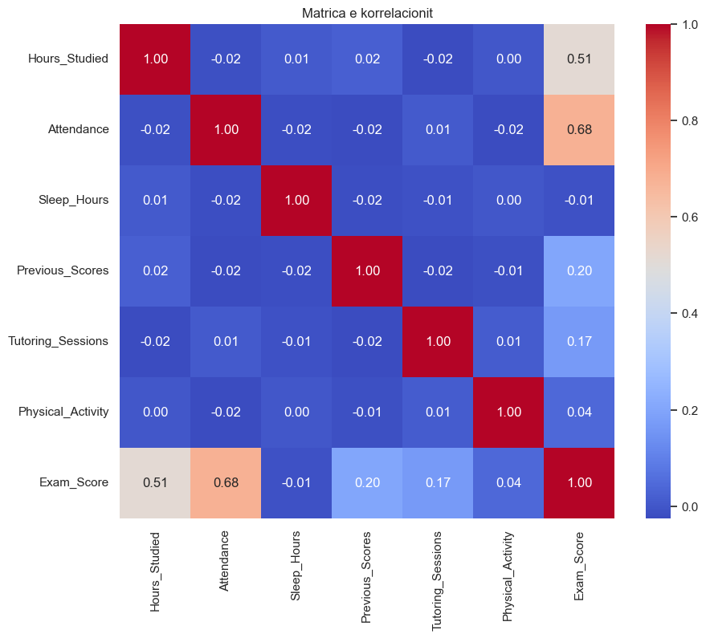
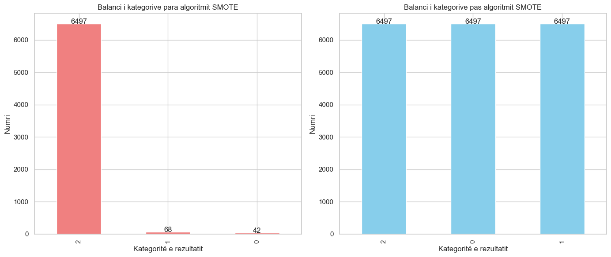

<div align="center">

### UNIVERSITETI I PRISHTINЁS  
### FAKULTETI I INXHINIERISË ELEKTRIKE DHE KOMPJUTERIKE  


### Lënda: Përgatitja dhe vizualizimi i të dhënave
### Projekti: Faktorët e performancës së studentëve
<div align="left"><h3>Mentor: Prof. Dr. Mërgim Hoti</h3></div>
<div align="left"><h3>Kontribuesit: Lirim Islami, Arbnor Puka, Enis Halilaj</h3></div>

</div>

# Faktorët e performancës së studentëve

Ky projekt është pjesë e lëndës **Përgatitja dhe Vizualizimi i të Dhënave** në kuadër të programit të studimeve Master IKS 2024/25. 
Projekti ynë ka për qëllim të analizojë dhe vizualizojë faktorët që ndikojnë në performancën akademike të studentëve duke përdorur teknika të përpunimit dhe vizualizimit të të dhënave.

Për të realizuar këtë projekt, kemi përdorur këtë dataset: **[Student Performance Factors](https://www.kaggle.com/datasets/lainguyn123/student-performance-factors)**

## Udhëzime në ekzekutimin e projektit
Për të ekzekutuar projektin në pajisjen tuaj, ndiqni këto hapa:

### 1. Kërkesat
Sigurohuni që të keni të instaluar **Python 3.6** ose versionin më të ri. Mund ta shkarkoni nga [python.org](https://www.python.org/downloads/).

### 2. Klonimi i projektit
Klononi projektin me komandën:
```bash
git clone https://github.com/enis-halilaj/pvdh-projekti-msc
```

### 3. Instalimi i paketave
Pasi të jeni në direktoriumin e projektit, instaloni paketat duke përdorur këtë komandë:
```bash
pip3 install -r requirements.txt
```

<h1>Faktorët e performancës së studentëve</h1>

<p>Qëllimi i preprocesimit të datasetit <b>Faktorët e performancës së studentëve</b> është të strukturojë dhe pastrojë të dhënat për të lehtësuar analizën e thellë të ndikimeve në performancën akademike të studentëve. Ky proces siguron që të dhënat të jenë të pastra, të organizuara, dhe të gatshme për të zbuluar lidhjet kyçe që influencojnë suksesin e studentëve. Përmes kësaj analize të dhënash të përpunuara, mund të identifikohen dhe zbatohen strategji të efektshme arsimore që ndihmojnë në përmirësimin e arritjeve të studentëve dhe në ngritjen e cilësisë së proceseve mësimore.</p>

<h3>Libraritë e përdorura</h3>


```python
import pandas as pd
import numpy as np
from scipy import stats
from scipy.stats import zscore, norm
from IPython.display import display
from sklearn.preprocessing import MinMaxScaler, StandardScaler, LabelEncoder
from sklearn.cluster import DBSCAN, KMeans
import matplotlib.pyplot as plt
import seaborn as sns
from imblearn.over_sampling import SMOTE, ADASYN
import seaborn as sns
import pandas as pd
from sklearn.ensemble import IsolationForest
from sklearn.decomposition import PCA
from scipy.cluster.hierarchy import linkage, dendrogram
from scipy.interpolate import griddata
```

<h3>Leximi i datasetit</h3>


```python
# Dataframe kryesor
main_df = pd.read_csv("../dataset/StudentPerformanceFactors.csv")

# Dataframe i preprocesuar
pre_df = pd.read_csv("../dataset/StudentPerformanceFactors_new.csv")
```

<h2>1. FAZA E PARË</h2>

<h3>Kualiteti i të dhënave</h3>

<h4>Struktura e datasetit </h4>


```python
display(main_df.head())
```


<div>
<table border="1" class="dataframe">
  <thead>
    <tr style="text-align: right;">
      <th></th>
      <th>Hours_Studied</th>
      <th>Attendance</th>
      <th>Parental_Involvement</th>
      <th>Access_to_Resources</th>
      <th>Extracurricular_Activities</th>
      <th>Sleep_Hours</th>
      <th>Previous_Scores</th>
      <th>Motivation_Level</th>
      <th>Internet_Access</th>
      <th>Tutoring_Sessions</th>
      <th>Family_Income</th>
      <th>Teacher_Quality</th>
      <th>School_Type</th>
      <th>Peer_Influence</th>
      <th>Physical_Activity</th>
      <th>Learning_Disabilities</th>
      <th>Parental_Education_Level</th>
      <th>Distance_from_Home</th>
      <th>Gender</th>
      <th>Exam_Score</th>
    </tr>
  </thead>
  <tbody>
    <tr>
      <th>0</th>
      <td>23</td>
      <td>84</td>
      <td>Low</td>
      <td>High</td>
      <td>No</td>
      <td>7</td>
      <td>73</td>
      <td>Low</td>
      <td>Yes</td>
      <td>0</td>
      <td>Low</td>
      <td>Medium</td>
      <td>Public</td>
      <td>Positive</td>
      <td>3</td>
      <td>No</td>
      <td>High School</td>
      <td>Near</td>
      <td>Male</td>
      <td>67</td>
    </tr>
    <tr>
      <th>1</th>
      <td>19</td>
      <td>64</td>
      <td>Low</td>
      <td>Medium</td>
      <td>No</td>
      <td>8</td>
      <td>59</td>
      <td>Low</td>
      <td>Yes</td>
      <td>2</td>
      <td>Medium</td>
      <td>Medium</td>
      <td>Public</td>
      <td>Negative</td>
      <td>4</td>
      <td>No</td>
      <td>College</td>
      <td>Moderate</td>
      <td>Female</td>
      <td>61</td>
    </tr>
    <tr>
      <th>2</th>
      <td>24</td>
      <td>98</td>
      <td>Medium</td>
      <td>Medium</td>
      <td>Yes</td>
      <td>7</td>
      <td>91</td>
      <td>Medium</td>
      <td>Yes</td>
      <td>2</td>
      <td>Medium</td>
      <td>Medium</td>
      <td>Public</td>
      <td>Neutral</td>
      <td>4</td>
      <td>No</td>
      <td>Postgraduate</td>
      <td>Near</td>
      <td>Male</td>
      <td>74</td>
    </tr>
    <tr>
      <th>3</th>
      <td>29</td>
      <td>89</td>
      <td>Low</td>
      <td>Medium</td>
      <td>Yes</td>
      <td>8</td>
      <td>98</td>
      <td>Medium</td>
      <td>Yes</td>
      <td>1</td>
      <td>Medium</td>
      <td>Medium</td>
      <td>Public</td>
      <td>Negative</td>
      <td>4</td>
      <td>No</td>
      <td>High School</td>
      <td>Moderate</td>
      <td>Male</td>
      <td>71</td>
    </tr>
    <tr>
      <th>4</th>
      <td>19</td>
      <td>92</td>
      <td>Medium</td>
      <td>Medium</td>
      <td>Yes</td>
      <td>6</td>
      <td>65</td>
      <td>Medium</td>
      <td>Yes</td>
      <td>3</td>
      <td>Medium</td>
      <td>High</td>
      <td>Public</td>
      <td>Neutral</td>
      <td>4</td>
      <td>No</td>
      <td>College</td>
      <td>Near</td>
      <td>Female</td>
      <td>70</td>
    </tr>
  </tbody>
</table>
</div>


<h4>Definimi i tipeve të të dhënave</h4>


```python
print("Tipet e të dhënave: \n")
print(main_df.dtypes)

# Atributet kategorike dhe numerike
categorical_columns = main_df.select_dtypes(include=['object']).columns
numerical_columns = main_df.select_dtypes(include=['int64', 'float64']).columns

print("\nAtributet kategorike:", list(categorical_columns))
print("\nAtributet numerike :", list(numerical_columns))
```

    Tipet e të dhënave: 
    
    Hours_Studied                  int64
    Attendance                     int64
    Parental_Involvement          object
    Access_to_Resources           object
    Extracurricular_Activities    object
    Sleep_Hours                    int64
    Previous_Scores                int64
    Motivation_Level              object
    Internet_Access               object
    Tutoring_Sessions              int64
    Family_Income                 object
    Teacher_Quality               object
    School_Type                   object
    Peer_Influence                object
    Physical_Activity              int64
    Learning_Disabilities         object
    Parental_Education_Level      object
    Distance_from_Home            object
    Gender                        object
    Exam_Score                     int64
    dtype: object
    
    Atributet kategorike: ['Parental_Involvement', 'Access_to_Resources', 'Extracurricular_Activities', 'Motivation_Level', 'Internet_Access', 'Family_Income', 'Teacher_Quality', 'School_Type', 'Peer_Influence', 'Learning_Disabilities', 'Parental_Education_Level', 'Distance_from_Home', 'Gender']
    
    Atributet numerike : ['Hours_Studied', 'Attendance', 'Sleep_Hours', 'Previous_Scores', 'Tutoring_Sessions', 'Physical_Activity', 'Exam_Score']


<h4>Menaxhimi vlerave të zbrazëta (null):</h4>


```python
# Metoda për gjetjen e vlerave null
null_counts = pre_df.isnull().sum()

print(null_counts)
has_nulls = pre_df.isnull().any()

print('\nAtributet që kanë vlera të zbrazëta (null):', ', '.join(has_nulls[has_nulls].index))
```

    Hours_Studied                  0
    Attendance                     0
    Parental_Involvement           0
    Access_to_Resources            0
    Extracurricular_Activities     0
    Sleep_Hours                    0
    Previous_Scores                0
    Motivation_Level               0
    Internet_Access                0
    Tutoring_Sessions              0
    Family_Income                  0
    Teacher_Quality               78
    School_Type                    0
    Peer_Influence                 0
    Physical_Activity              0
    Learning_Disabilities          0
    Parental_Education_Level      90
    Distance_from_Home            67
    Gender                         0
    Exam_Score                     0
    dtype: int64
    
    Atributet që kanë vlera të zbrazëta (null): Teacher_Quality, Parental_Education_Level, Distance_from_Home


<p>Në kodin më poshtë, kemi përpunuar të dhënat duke zëvëndësuar vlerat null me vlera të përshtatshme në varësi të tipit të atributit (kolonës). Fillimisht kemi bërë identifikimin e kolonave me vlera të zbrazëta të cilat ndahen në dy grupe: numerike dhe kategorike. Kolonat numerike zëvëndësohen me medianën për të shmangur ndikimin e outliers, ndërsa kolona të tjera numerike përdorin mesataren. Për kolonat kategorike, vlerat null zëvëndesohen me vlerën më të shpeshtë. Pas kësaj kontrollohet dataset-i për të siguruar që të gjitha vlerat <b>null</b> janë zëvëndësuar duke lejuar modifikimin direkt të të dhënave me <b>inplace=True</b> dhe duke parandaluar kopjet e padëshiruara.</p>


```python
# Ndarja e kolonave në numerike dhe kategorike
numeric_cols = pre_df.select_dtypes(include=['float64', 'int64']).columns
categorical_cols = pre_df.select_dtypes(include=['object', 'category']).columns

# Për kolonat numerike vendos medianen si vlerë në Exam_Score
pre_df.fillna({'Exam_Score': pre_df['Exam_Score'].median()}, inplace=True)

# Vendos vlerën mesatare në kolonat e tjera numerike
for col in numeric_cols:
    if col != 'Exam_Score':
        pre_df.fillna({col: pre_df[col].mean()}, inplace=True)

# Për kolonat kategorike plotëso vlerat e zbrazëta me vlerën më të shpeshtë
for col in categorical_cols:
    pre_df.fillna({col: pre_df[col].mode()[0]}, inplace=True)

# Kontrollo përsëri për vlerat e zbrazëta për të konfirmuar
print("Atributet që kanë vlera null:")
print(pre_df.isnull().sum())

```

    Atributet që kanë vlera null:
    Hours_Studied                 0
    Attendance                    0
    Parental_Involvement          0
    Access_to_Resources           0
    Extracurricular_Activities    0
    Sleep_Hours                   0
    Previous_Scores               0
    Motivation_Level              0
    Internet_Access               0
    Tutoring_Sessions             0
    Family_Income                 0
    Teacher_Quality               0
    School_Type                   0
    Peer_Influence                0
    Physical_Activity             0
    Learning_Disabilities         0
    Parental_Education_Level      0
    Distance_from_Home            0
    Gender                        0
    Exam_Score                    0
    dtype: int64


```python
# Lista e kolonave që duhet kontrolluar për vlera të zbrazëta
columns = [
    'Hours_Studied', 
    'Attendance', 
    'Parental_Involvement', 
    # 'Access_to_Resources', 
    'Extracurricular_Activities', 
    'Sleep_Hours', 
    'Previous_Scores', 
    'Motivation_Level', 
    'Internet_Access', 
    'Tutoring_Sessions', 
    'Family_Income', 
    'Teacher_Quality', 
    'School_Type', 
    'Peer_Influence', 
    'Physical_Activity', 
    'Learning_Disabilities', 
    'Parental_Education_Level', 
    'Distance_from_Home', 
    'Gender', 
    'Exam_Score'
]

# Largo rreshtat me vlera null në kolonat e specifikuara më lartë
pre_df.dropna(subset=columns, inplace=True)

# Shfaqni numrin e vlerave null që kanë mbetur në çdo kolonë
print(pre_df.isnull().sum())

```

    Hours_Studied                 0
    Attendance                    0
    Parental_Involvement          0
    Access_to_Resources           0
    Extracurricular_Activities    0
    Sleep_Hours                   0
    Previous_Scores               0
    Motivation_Level              0
    Internet_Access               0
    Tutoring_Sessions             0
    Family_Income                 0
    Teacher_Quality               0
    School_Type                   0
    Peer_Influence                0
    Physical_Activity             0
    Learning_Disabilities         0
    Parental_Education_Level      0
    Distance_from_Home            0
    Gender                        0
    Exam_Score                    0
    dtype: int64


<h4>Identifikimi i duplikimeve (duplicates)</h4>


```python
# Komanda për identifikimin e duplikimeve
print("Duplikimet e gjetura: " + str(pre_df.duplicated().sum()))
```

    Duplikimet e gjetura: 0


<p>Në dataset-in tonë nuk kemi gjetur ndonjë duplikat prandaj nuk ishte e nevojshme të bëjme asnjë fshirje të duplikateve. Kjo konfirmon kualitetin e të dhënave dhe na lejon të vazhdojmë me analizën e mëtejme.</p>

<h3>Agregimi i të dhënave</h3>


```python
# Agregimi sipas 'Parental_Involvement' dhe 'Internet_Access' për të vlerësuar ndikimin e tyre në 'Previous_Scores'.
# Ky agregim na ndihmon të kuptojmë se si mbështetja nga prindërit dhe qasja në internet ndikojnë në rezultatet e provimeve të nxënësve.
avg_previous_scores_by_parental_involvement_and_internet = pre_df.groupby(['Parental_Involvement', 'Internet_Access']).agg({
    'Exam_Score': 'mean'
}).round(2)

# Agregimi sipas 'School_Type' dhe 'Teacher_Quality' për të vlerësuar ndikimin e tyre në 'Hours_Studied'.
#Ky agregim shqyrton se si mjedisi arsimor dhe cilësia e mësimit ndikojnë në sasinë e kohës që studentët dedikojnë për studime.
avg_hours_studied_by_school_and_teacher = pre_df.groupby(['School_Type', 'Teacher_Quality']).agg({
    'Hours_Studied': 'mean'
}).round(2)

print("Mesatarja e rezultateve të mëparshme sipas përfshirjes së prindërve dhe çasjes në internet:")
print(avg_previous_scores_by_parental_involvement_and_internet)

print("Mesatarja e orëve të studiuara sipas llojit të shkollës dhe cilësisë së mësuesit:")
print(avg_hours_studied_by_school_and_teacher)
```

    Mesatarja e rezultateve të mëparshme sipas përfshirjes së prindërve dhe çasjes në internet:
                                          Exam_Score
    Parental_Involvement Internet_Access            
    High                 No                    67.07
                         Yes                   68.17
    Low                  No                    66.12
                         Yes                   66.38
    Medium               No                    66.42
                         Yes                   67.15
    Mesatarja e orëve të studiuara sipas llojit të shkollës dhe cilësisë së mësuesit:
                                 Hours_Studied
    School_Type Teacher_Quality               
    Private     High                     19.82
                Low                      20.18
                Medium                   20.01
    Public      High                     19.98
                Low                      19.91
                Medium                   19.98


```python
# Agregimi sipas pjesëmarrjes në aktivitete jashtëkurrikulare dhe ndikimi i tyre në orët e gjumit dhe rezultatet e provimeve
# Vlerësojmë nëse angazhimi në aktivitete jashtëkurrikulare ka ndërlidhje me performancë më të mirë në provime dhe si ndikon në orët e gjumit.
avg_scores_sleep_by_activities = pre_df.groupby('Extracurricular_Activities').agg({
    'Exam_Score': 'mean',
    'Sleep_Hours': 'mean'
}).round(2)

# Agregimi sipas 'Teacher_Quality' dhe 'Distance_from_Home' për të vlerësuar ndikimin e tyre në 'Attendance'.
# Ky agregim ndihmon në identifikimin e ndërveprimeve mes faktorëve arsimorë dhe logjistikë që mund të ndikojnë në frekuencën e pranisë së studentëve në shkollë.
avg_attendance_by_teacher_quality_and_distance = pre_df.groupby(['Teacher_Quality', 'Distance_from_Home']).agg({
    'Attendance': 'mean'
}).round(2)

print("\nMesatarja e rezultateve të provimeve dhe orëve të gjumit sipas pjesëmarrjes në aktivitete jashtëkurrikulare: ")
print(avg_scores_sleep_by_activities)

print("Mesatarja e Pjesëmarrjes sipas cilësisë së mësuesit dhe distanca nga shtëpia: ")
print(avg_attendance_by_teacher_quality_and_distance)
```

    
    Mesatarja e rezultateve të provimeve dhe orëve të gjumit sipas pjesëmarrjes në aktivitete jashtëkurrikulare: 
                                Exam_Score  Sleep_Hours
    Extracurricular_Activities                         
    No                               66.93         7.03
    Yes                              67.44         7.03
    Mesatarja e Pjesëmarrjes sipas cilësisë së mësuesit dhe distanca nga shtëpia: 
                                        Attendance
    Teacher_Quality Distance_from_Home            
    High            Far                      79.70
                    Moderate                 79.66
                    Near                     80.30
    Low             Far                      78.23
                    Moderate                 80.12
                    Near                     80.61
    Medium          Far                      79.48
                    Moderate                 79.91
                    Near                     79.97


<h3>Mostrimi i të dhënave</h3>
<p>Mostrimi i të dhënave është procesi i zgjedhjes së një numri të vogël të elementeve nga një grup më i madh për të kryer analiza më të shpejta dhe më ekonomike, pa pasur nevojë të shikojmë të gjitha të dhënat</p>


```python
# Vizualizimi i marrëdhënies midis Previous Scores, Exam Score dhe Hours Studied pa mostrim

plt.figure(figsize=(20, 6))
scatter = sns.scatterplot(data=pre_df, x='Previous_Scores', y='Exam_Score', hue='Hours_Studied', palette='coolwarm', size='Hours_Studied', sizes=(20, 200))
plt.title('Marrëdhënia midis rezultateve të mëparshme të provimeve, rezultateve të provimeve aktuale dhe orëve të studiuara')
plt.xlabel('Rezultatet e mëparshme të provimeve')
plt.ylabel('Rezultatet e provimeve aktuale')
plt.legend(title='Orët e studiuara')
plt.grid(True)
plt.show()
```


    

    


```python
# Selektimi i rreshtave të datasetit për mostrim
# sample_df = pre_df.sample(n=500)
sample_df = pre_df.sample(frac=0.1, random_state=1) 
# 10% e datasetit për mostër farc = 0.1 (rangu duhet të jetë mes 0 dhe 1) 
# random state = 1 sepse e njejta mostër e rastësishme gjenerohet çdo herë kur ekzekutohet kodi.
# Nëse random_state nuk është përcaktuar, çdo herë që ekzekutohet kodi do të rezultojë në një mostrë ndoshta të ndryshme.
```


```python
# Vizualizimi i marrëdhënies midis Previous Scores, Exam Score dhe Hours Studied me mostrim
plt.figure(figsize=(20, 6))
scatter = sns.scatterplot(data=sample_df, x='Previous_Scores', y='Exam_Score', hue='Hours_Studied', palette='coolwarm', size='Hours_Studied', sizes=(20, 200))
plt.title('Marrëdhënia midis rezultateve të mëparshme të provimeve, rezultateve të provimeve aktuale dhe orëve të studiuara')
plt.xlabel('Rezultatet e mëparshme të provimeve')
plt.ylabel('Rezultatet e provimeve aktuale')
plt.legend(title='Orët e studiuara')
plt.grid(True)
plt.show()
```


    

    


```python
# Ndarja e orëve të studiuara në kuantilë
sample_df['study_quantile'] = pd.qcut(sample_df['Hours_Studied'], 4, labels=['Shumë pak', 'Pak', 'Mesatare', 'Shumë'])

# Llogaritja e mesatares së rezultateve të provimeve për secilin grup të orëve të studiuara
study_exam_scores = sample_df.groupby('study_quantile')['Exam_Score'].mean().reset_index(name='Average_Exam_Score')
sorted_scores = study_exam_scores.sort_values(by='Average_Exam_Score', ascending=True)

# Llogaritja e përqindjeve për diagram
total_scores = sorted_scores['Average_Exam_Score'].sum()
sizes = sorted_scores['Average_Exam_Score'] / total_scores * 100

# Përdorimi i një diagrami të ngjyrave për grupe të ndryshme të orëve të studiuara
colors = ['lightblue', 'blue', 'lightgreen', 'yellow']

# Vizatimi i grafikut të pie
plt.figure(figsize=(10, 6))
labels = sorted_scores['study_quantile']
explode = [0.05] * len(labels)  # Ndajmë çdo segment pak nga qendra

plt.pie(sizes, labels=labels, colors=colors, explode=explode, autopct='%1.1f%%', startangle=90)
plt.title('Mesatarja e rezultateve të provimeve sipas orëve të studiuara')
plt.axis('equal')
plt.legend(labels=[f'{level}: {score:.2f}' for level, score in zip(labels, sorted_scores['Average_Exam_Score'])], loc="best")
plt.show()
```


    

    


<h3>Reduktimi i dimensionalitetit</h3>
<p>Reduktimi i dimensionalitetit është një proces në analizën e të dhënave që përfshin zvogëlimin e numrit të variablave të përdorura në një dataset. Qëllimi është të largohen veçoritë e tepërta ose të pakorrelacionuara pa humbur informacione esenciale.</p>


```python
# Kontrollojmë strukturën aktuale të DataFrame
print("Struktura origjinale e DataFrame:")
display(pre_df.head())

# Kontrollojmë strukturën pas heqjes së kolonës
print("Struktura e re e datasetit pas heqjes së kolonës 'Access_to_Resources':")

# Heqja e kolonës 'Access_To_Resources'
if 'Access_to_Resources' in pre_df.columns:
    pre_df = pre_df.drop('Access_to_Resources', axis=1)
    pre_df.to_csv("../dataset/StudentPerformanceFactors_new.csv", index=False)
display(pre_df.head())
```

    Struktura origjinale e DataFrame:


<div>
<table border="1" class="dataframe">
  <thead>
    <tr style="text-align: right;">
      <th></th>
      <th>Hours_Studied</th>
      <th>Attendance</th>
      <th>Parental_Involvement</th>
      <th>Access_to_Resources</th>
      <th>Extracurricular_Activities</th>
      <th>Sleep_Hours</th>
      <th>Previous_Scores</th>
      <th>Motivation_Level</th>
      <th>Internet_Access</th>
      <th>Tutoring_Sessions</th>
      <th>Family_Income</th>
      <th>Teacher_Quality</th>
      <th>School_Type</th>
      <th>Peer_Influence</th>
      <th>Physical_Activity</th>
      <th>Learning_Disabilities</th>
      <th>Parental_Education_Level</th>
      <th>Distance_from_Home</th>
      <th>Gender</th>
      <th>Exam_Score</th>
    </tr>
  </thead>
  <tbody>
    <tr>
      <th>0</th>
      <td>23</td>
      <td>84</td>
      <td>Low</td>
      <td>High</td>
      <td>No</td>
      <td>7</td>
      <td>73</td>
      <td>Low</td>
      <td>Yes</td>
      <td>0</td>
      <td>Low</td>
      <td>Medium</td>
      <td>Public</td>
      <td>Positive</td>
      <td>3</td>
      <td>No</td>
      <td>High School</td>
      <td>Near</td>
      <td>Male</td>
      <td>67</td>
    </tr>
    <tr>
      <th>1</th>
      <td>19</td>
      <td>64</td>
      <td>Low</td>
      <td>Medium</td>
      <td>No</td>
      <td>8</td>
      <td>59</td>
      <td>Low</td>
      <td>Yes</td>
      <td>2</td>
      <td>Medium</td>
      <td>Medium</td>
      <td>Public</td>
      <td>Negative</td>
      <td>4</td>
      <td>No</td>
      <td>College</td>
      <td>Moderate</td>
      <td>Female</td>
      <td>61</td>
    </tr>
    <tr>
      <th>2</th>
      <td>24</td>
      <td>98</td>
      <td>Medium</td>
      <td>Medium</td>
      <td>Yes</td>
      <td>7</td>
      <td>91</td>
      <td>Medium</td>
      <td>Yes</td>
      <td>2</td>
      <td>Medium</td>
      <td>Medium</td>
      <td>Public</td>
      <td>Neutral</td>
      <td>4</td>
      <td>No</td>
      <td>Postgraduate</td>
      <td>Near</td>
      <td>Male</td>
      <td>74</td>
    </tr>
    <tr>
      <th>3</th>
      <td>29</td>
      <td>89</td>
      <td>Low</td>
      <td>Medium</td>
      <td>Yes</td>
      <td>8</td>
      <td>98</td>
      <td>Medium</td>
      <td>Yes</td>
      <td>1</td>
      <td>Medium</td>
      <td>Medium</td>
      <td>Public</td>
      <td>Negative</td>
      <td>4</td>
      <td>No</td>
      <td>High School</td>
      <td>Moderate</td>
      <td>Male</td>
      <td>71</td>
    </tr>
    <tr>
      <th>4</th>
      <td>19</td>
      <td>92</td>
      <td>Medium</td>
      <td>Medium</td>
      <td>Yes</td>
      <td>6</td>
      <td>65</td>
      <td>Medium</td>
      <td>Yes</td>
      <td>3</td>
      <td>Medium</td>
      <td>High</td>
      <td>Public</td>
      <td>Neutral</td>
      <td>4</td>
      <td>No</td>
      <td>College</td>
      <td>Near</td>
      <td>Female</td>
      <td>70</td>
    </tr>
  </tbody>
</table>
</div>


    Struktura e re e datasetit pas heqjes së kolonës 'Access_to_Resources':


<div>
<table border="1" class="dataframe">
  <thead>
    <tr style="text-align: right;">
      <th></th>
      <th>Hours_Studied</th>
      <th>Attendance</th>
      <th>Parental_Involvement</th>
      <th>Extracurricular_Activities</th>
      <th>Sleep_Hours</th>
      <th>Previous_Scores</th>
      <th>Motivation_Level</th>
      <th>Internet_Access</th>
      <th>Tutoring_Sessions</th>
      <th>Family_Income</th>
      <th>Teacher_Quality</th>
      <th>School_Type</th>
      <th>Peer_Influence</th>
      <th>Physical_Activity</th>
      <th>Learning_Disabilities</th>
      <th>Parental_Education_Level</th>
      <th>Distance_from_Home</th>
      <th>Gender</th>
      <th>Exam_Score</th>
    </tr>
  </thead>
  <tbody>
    <tr>
      <th>0</th>
      <td>23</td>
      <td>84</td>
      <td>Low</td>
      <td>No</td>
      <td>7</td>
      <td>73</td>
      <td>Low</td>
      <td>Yes</td>
      <td>0</td>
      <td>Low</td>
      <td>Medium</td>
      <td>Public</td>
      <td>Positive</td>
      <td>3</td>
      <td>No</td>
      <td>High School</td>
      <td>Near</td>
      <td>Male</td>
      <td>67</td>
    </tr>
    <tr>
      <th>1</th>
      <td>19</td>
      <td>64</td>
      <td>Low</td>
      <td>No</td>
      <td>8</td>
      <td>59</td>
      <td>Low</td>
      <td>Yes</td>
      <td>2</td>
      <td>Medium</td>
      <td>Medium</td>
      <td>Public</td>
      <td>Negative</td>
      <td>4</td>
      <td>No</td>
      <td>College</td>
      <td>Moderate</td>
      <td>Female</td>
      <td>61</td>
    </tr>
    <tr>
      <th>2</th>
      <td>24</td>
      <td>98</td>
      <td>Medium</td>
      <td>Yes</td>
      <td>7</td>
      <td>91</td>
      <td>Medium</td>
      <td>Yes</td>
      <td>2</td>
      <td>Medium</td>
      <td>Medium</td>
      <td>Public</td>
      <td>Neutral</td>
      <td>4</td>
      <td>No</td>
      <td>Postgraduate</td>
      <td>Near</td>
      <td>Male</td>
      <td>74</td>
    </tr>
    <tr>
      <th>3</th>
      <td>29</td>
      <td>89</td>
      <td>Low</td>
      <td>Yes</td>
      <td>8</td>
      <td>98</td>
      <td>Medium</td>
      <td>Yes</td>
      <td>1</td>
      <td>Medium</td>
      <td>Medium</td>
      <td>Public</td>
      <td>Negative</td>
      <td>4</td>
      <td>No</td>
      <td>High School</td>
      <td>Moderate</td>
      <td>Male</td>
      <td>71</td>
    </tr>
    <tr>
      <th>4</th>
      <td>19</td>
      <td>92</td>
      <td>Medium</td>
      <td>Yes</td>
      <td>6</td>
      <td>65</td>
      <td>Medium</td>
      <td>Yes</td>
      <td>3</td>
      <td>Medium</td>
      <td>High</td>
      <td>Public</td>
      <td>Neutral</td>
      <td>4</td>
      <td>No</td>
      <td>College</td>
      <td>Near</td>
      <td>Female</td>
      <td>70</td>
    </tr>
  </tbody>
</table>
</div>


<h3>Zgjedhja e nën-bashkësise të vetive</h3>

<p>Duke përdorur datasetin e ri të gjeneruar, fillojmë me përcaktimin e vetive më të rëndësishme për analizë, duke u fokusuar në ato që janë të lidhura ngushtë me <b>Exam_Score</b>.</p>


```python
# Zgjedhja e nënbashkësise të vetive
features_selected = [
    'Hours_Studied', 
    'Attendance', 
    'Parental_Involvement', 
    # 'Access_to_Resources',
    'Extracurricular_Activities', 
    'Sleep_Hours', 
    'Previous_Scores', 
    'Motivation_Level', 
    'Internet_Access', 
    'Tutoring_Sessions', 
    'Family_Income', 
    'Teacher_Quality', 
    'Peer_Influence', 
    'Physical_Activity', 
    'Gender'
]

# Krijojmë një dataframe të ri me vetitë e zgjedhura
df_selected_features = pre_df[features_selected + ['Exam_Score']]

# Shfaqim disa rreshta nga dataframe-i i ri
print("Dataframe me vetitë e zgjedhura:")
display(df_selected_features)

# subset_conditional_df = pre_df[(pre_df['School_Type'] == 'Public') & (pre_df['Parental_Involvement'] == 'High')]
# print(subset_conditional_df.head()) 
```

    Dataframe me vetitë e zgjedhura:


<div>
<table border="1" class="dataframe">
  <thead>
    <tr style="text-align: right;">
      <th></th>
      <th>Hours_Studied</th>
      <th>Attendance</th>
      <th>Parental_Involvement</th>
      <th>Extracurricular_Activities</th>
      <th>Sleep_Hours</th>
      <th>Previous_Scores</th>
      <th>Motivation_Level</th>
      <th>Internet_Access</th>
      <th>Tutoring_Sessions</th>
      <th>Family_Income</th>
      <th>Teacher_Quality</th>
      <th>Peer_Influence</th>
      <th>Physical_Activity</th>
      <th>Gender</th>
      <th>Exam_Score</th>
    </tr>
  </thead>
  <tbody>
    <tr>
      <th>0</th>
      <td>23</td>
      <td>84</td>
      <td>Low</td>
      <td>No</td>
      <td>7</td>
      <td>73</td>
      <td>Low</td>
      <td>Yes</td>
      <td>0</td>
      <td>Low</td>
      <td>Medium</td>
      <td>Positive</td>
      <td>3</td>
      <td>Male</td>
      <td>67</td>
    </tr>
    <tr>
      <th>1</th>
      <td>19</td>
      <td>64</td>
      <td>Low</td>
      <td>No</td>
      <td>8</td>
      <td>59</td>
      <td>Low</td>
      <td>Yes</td>
      <td>2</td>
      <td>Medium</td>
      <td>Medium</td>
      <td>Negative</td>
      <td>4</td>
      <td>Female</td>
      <td>61</td>
    </tr>
    <tr>
      <th>2</th>
      <td>24</td>
      <td>98</td>
      <td>Medium</td>
      <td>Yes</td>
      <td>7</td>
      <td>91</td>
      <td>Medium</td>
      <td>Yes</td>
      <td>2</td>
      <td>Medium</td>
      <td>Medium</td>
      <td>Neutral</td>
      <td>4</td>
      <td>Male</td>
      <td>74</td>
    </tr>
    <tr>
      <th>3</th>
      <td>29</td>
      <td>89</td>
      <td>Low</td>
      <td>Yes</td>
      <td>8</td>
      <td>98</td>
      <td>Medium</td>
      <td>Yes</td>
      <td>1</td>
      <td>Medium</td>
      <td>Medium</td>
      <td>Negative</td>
      <td>4</td>
      <td>Male</td>
      <td>71</td>
    </tr>
    <tr>
      <th>4</th>
      <td>19</td>
      <td>92</td>
      <td>Medium</td>
      <td>Yes</td>
      <td>6</td>
      <td>65</td>
      <td>Medium</td>
      <td>Yes</td>
      <td>3</td>
      <td>Medium</td>
      <td>High</td>
      <td>Neutral</td>
      <td>4</td>
      <td>Female</td>
      <td>70</td>
    </tr>
    <tr>
      <th>...</th>
      <td>...</td>
      <td>...</td>
      <td>...</td>
      <td>...</td>
      <td>...</td>
      <td>...</td>
      <td>...</td>
      <td>...</td>
      <td>...</td>
      <td>...</td>
      <td>...</td>
      <td>...</td>
      <td>...</td>
      <td>...</td>
      <td>...</td>
    </tr>
    <tr>
      <th>6602</th>
      <td>25</td>
      <td>69</td>
      <td>High</td>
      <td>No</td>
      <td>7</td>
      <td>76</td>
      <td>Medium</td>
      <td>Yes</td>
      <td>1</td>
      <td>High</td>
      <td>Medium</td>
      <td>Positive</td>
      <td>2</td>
      <td>Female</td>
      <td>68</td>
    </tr>
    <tr>
      <th>6603</th>
      <td>23</td>
      <td>76</td>
      <td>High</td>
      <td>No</td>
      <td>8</td>
      <td>81</td>
      <td>Medium</td>
      <td>Yes</td>
      <td>3</td>
      <td>Low</td>
      <td>High</td>
      <td>Positive</td>
      <td>2</td>
      <td>Female</td>
      <td>69</td>
    </tr>
    <tr>
      <th>6604</th>
      <td>20</td>
      <td>90</td>
      <td>Medium</td>
      <td>Yes</td>
      <td>6</td>
      <td>65</td>
      <td>Low</td>
      <td>Yes</td>
      <td>3</td>
      <td>Low</td>
      <td>Medium</td>
      <td>Negative</td>
      <td>2</td>
      <td>Female</td>
      <td>68</td>
    </tr>
    <tr>
      <th>6605</th>
      <td>10</td>
      <td>86</td>
      <td>High</td>
      <td>Yes</td>
      <td>6</td>
      <td>91</td>
      <td>High</td>
      <td>Yes</td>
      <td>2</td>
      <td>Low</td>
      <td>Medium</td>
      <td>Positive</td>
      <td>3</td>
      <td>Female</td>
      <td>68</td>
    </tr>
    <tr>
      <th>6606</th>
      <td>15</td>
      <td>67</td>
      <td>Medium</td>
      <td>Yes</td>
      <td>9</td>
      <td>94</td>
      <td>Medium</td>
      <td>Yes</td>
      <td>0</td>
      <td>Medium</td>
      <td>Medium</td>
      <td>Positive</td>
      <td>4</td>
      <td>Male</td>
      <td>64</td>
    </tr>
  </tbody>
</table>
<p>6607 rows × 15 columns</p>
</div>


<h4>Krijimi i vetive të reja</h4>

<p>Një prej vetive të cilat do të krijojmë është <b>Study_Rating</b> e cila është një prodhim i <b>Hours_Studied</b> dhe <b>Prevous_Scores</b>. Ky atribut do të ndihmoj për të kuptuar se sa efektive janë order e studimit në lidhje me rezultatet e meparshme.</p>


```python
# Krijimi i vetive të reja
df_selected_features['Study_Rating'] = (df_selected_features['Hours_Studied'] * df_selected_features['Previous_Scores'] / 3000) * 100 # Maksimumi 30 orë * 100 pikë = 3000
df_selected_features['Study_Rating'] = df_selected_features['Study_Rating'].apply(lambda x: f"{round(x, 2)}%")

# Shfaqim disa rreshta nga dataframe-i për të kontrolluar Study_Rating
print("Dataframe pas krijimit të Study_Rating:")
display(df_selected_features[['Hours_Studied', 'Previous_Scores', 'Study_Rating']].head())
```

    Dataframe pas krijimit të Study_Rating:


<div>
<table border="1" class="dataframe">
  <thead>
    <tr style="text-align: right;">
      <th></th>
      <th>Hours_Studied</th>
      <th>Previous_Scores</th>
      <th>Study_Rating</th>
    </tr>
  </thead>
  <tbody>
    <tr>
      <th>0</th>
      <td>23</td>
      <td>73</td>
      <td>55.97%</td>
    </tr>
    <tr>
      <th>1</th>
      <td>19</td>
      <td>59</td>
      <td>37.37%</td>
    </tr>
    <tr>
      <th>2</th>
      <td>24</td>
      <td>91</td>
      <td>72.8%</td>
    </tr>
    <tr>
      <th>3</th>
      <td>29</td>
      <td>98</td>
      <td>94.73%</td>
    </tr>
    <tr>
      <th>4</th>
      <td>19</td>
      <td>65</td>
      <td>41.17%</td>
    </tr>
  </tbody>
</table>
</div>


<p>Një tjetër veti e re do të jetë <b>Activity_Score</b> e cila është një shprehje për të kombinuar disa aktivitete fizike dhe jashtë shkollore. Përdorim <b>Physical_Activity</b> dhe <b>Extracurricular_Activity</b> për të krijuar këtë veti.


```python
# Krijimi i Activity_Score bazuar në aktivitetet fizike dhe jashtë shkollore
df_selected_features.loc[:, 'Activity_Score'] = df_selected_features['Physical_Activity'] + df_selected_features['Extracurricular_Activities'].apply(lambda x: 1 if x == 'Yes' else 0)

# Shfaqim disa rreshta nga dataframe-i për të kontrolluar Activity_Score
print("Dataframe pas krijimit të Activity_Score:")
display(df_selected_features[['Physical_Activity', 'Extracurricular_Activities', 'Activity_Score']].head())
```

    Dataframe pas krijimit të Activity_Score:


<div>
<table border="1" class="dataframe">
  <thead>
    <tr style="text-align: right;">
      <th></th>
      <th>Physical_Activity</th>
      <th>Extracurricular_Activities</th>
      <th>Activity_Score</th>
    </tr>
  </thead>
  <tbody>
    <tr>
      <th>0</th>
      <td>3</td>
      <td>No</td>
      <td>3</td>
    </tr>
    <tr>
      <th>1</th>
      <td>4</td>
      <td>No</td>
      <td>4</td>
    </tr>
    <tr>
      <th>2</th>
      <td>4</td>
      <td>Yes</td>
      <td>5</td>
    </tr>
    <tr>
      <th>3</th>
      <td>4</td>
      <td>Yes</td>
      <td>5</td>
    </tr>
    <tr>
      <th>4</th>
      <td>4</td>
      <td>Yes</td>
      <td>5</td>
    </tr>
  </tbody>
</table>
</div>


<h3>Binarizimi i Sleep_Hours</h3>

<p>Krijojmë vetinë e cila tregon nëse një student ka më shumë se 7 ore gjumë, duke e binarizuar atë. Kjo mund të ndihmoj për të kuptuar ndikimin e gjumit/pushimit në performancën akademike.</p>


```python
# Krijimi i dataframe-it të ri me një kopje
df_selected_features = pre_df[features_selected + ['Exam_Score']].copy()

# Binarizimi i Sleep_Hours: 0 për më pak se 7 orë, 1 për 7 orë ose më shumë
df_selected_features.loc[:, 'Sleep_Binary'] = df_selected_features['Sleep_Hours'].apply(lambda x: 1 if x >= 7 else 0)

# Shfaqim disa rreshta nga dataframe-i për të kontrolluar Sleep_Binary
print("Dataframe pas binarizimit të Sleep_Hours:")
display(df_selected_features[['Sleep_Hours', 'Sleep_Binary']].head())

```

    Dataframe pas binarizimit të Sleep_Hours:


<div>
<table border="1" class="dataframe">
  <thead>
    <tr style="text-align: right;">
      <th></th>
      <th>Sleep_Hours</th>
      <th>Sleep_Binary</th>
    </tr>
  </thead>
  <tbody>
    <tr>
      <th>0</th>
      <td>7</td>
      <td>1</td>
    </tr>
    <tr>
      <th>1</th>
      <td>8</td>
      <td>1</td>
    </tr>
    <tr>
      <th>2</th>
      <td>7</td>
      <td>1</td>
    </tr>
    <tr>
      <th>3</th>
      <td>8</td>
      <td>1</td>
    </tr>
    <tr>
      <th>4</th>
      <td>6</td>
      <td>0</td>
    </tr>
  </tbody>
</table>
</div>


<p>Krijojmë vetinë <b>Family_Income</b> duke bërë binarizimin për të krijuar një veti që tregon nëse të ardhurat e familjes janë të larta ose të ulta. Kjo mund të bëhet duke klasifikuar <b>Family_Income</b> nëpër disa kategori <b>low, medium, high.</b>


```python
# Binarizimi i Family_Income: 0 për "Low", 1 për "Medium" dhe "High"
df_selected_features.loc[:, 'Income_Binary'] = df_selected_features['Family_Income'].apply(lambda x: 1 if x in ['Medium', 'High'] else 0)

# Shfaqim disa rreshta nga dataframe-i për të kontrolluar Income_Binary
print("Dataframe pas binarizimit të Family_Income:")
display(df_selected_features[['Family_Income', 'Income_Binary']].head())

```

    Dataframe pas binarizimit të Family_Income:


<div>
<table border="1" class="dataframe">
  <thead>
    <tr style="text-align: right;">
      <th></th>
      <th>Family_Income</th>
      <th>Income_Binary</th>
    </tr>
  </thead>
  <tbody>
    <tr>
      <th>0</th>
      <td>Low</td>
      <td>0</td>
    </tr>
    <tr>
      <th>1</th>
      <td>Medium</td>
      <td>1</td>
    </tr>
    <tr>
      <th>2</th>
      <td>Medium</td>
      <td>1</td>
    </tr>
    <tr>
      <th>3</th>
      <td>Medium</td>
      <td>1</td>
    </tr>
    <tr>
      <th>4</th>
      <td>Medium</td>
      <td>1</td>
    </tr>
  </tbody>
</table>
</div>


<h3>Kontrollimi i të dhënave të reja</h3>


```python
# Shikoni strukturën e re të dataframe-it
print("Dataframe pas krijimit të vetive të reja:")
display(df_selected_features.head())
```

    Dataframe pas krijimit të vetive të reja:


<div>
<table border="1" class="dataframe">
  <thead>
    <tr style="text-align: right;">
      <th></th>
      <th>Hours_Studied</th>
      <th>Attendance</th>
      <th>Parental_Involvement</th>
      <th>Extracurricular_Activities</th>
      <th>Sleep_Hours</th>
      <th>Previous_Scores</th>
      <th>Motivation_Level</th>
      <th>Internet_Access</th>
      <th>Tutoring_Sessions</th>
      <th>Family_Income</th>
      <th>Teacher_Quality</th>
      <th>Peer_Influence</th>
      <th>Physical_Activity</th>
      <th>Gender</th>
      <th>Exam_Score</th>
      <th>Sleep_Binary</th>
      <th>Income_Binary</th>
    </tr>
  </thead>
  <tbody>
    <tr>
      <th>0</th>
      <td>23</td>
      <td>84</td>
      <td>Low</td>
      <td>No</td>
      <td>7</td>
      <td>73</td>
      <td>Low</td>
      <td>Yes</td>
      <td>0</td>
      <td>Low</td>
      <td>Medium</td>
      <td>Positive</td>
      <td>3</td>
      <td>Male</td>
      <td>67</td>
      <td>1</td>
      <td>0</td>
    </tr>
    <tr>
      <th>1</th>
      <td>19</td>
      <td>64</td>
      <td>Low</td>
      <td>No</td>
      <td>8</td>
      <td>59</td>
      <td>Low</td>
      <td>Yes</td>
      <td>2</td>
      <td>Medium</td>
      <td>Medium</td>
      <td>Negative</td>
      <td>4</td>
      <td>Female</td>
      <td>61</td>
      <td>1</td>
      <td>1</td>
    </tr>
    <tr>
      <th>2</th>
      <td>24</td>
      <td>98</td>
      <td>Medium</td>
      <td>Yes</td>
      <td>7</td>
      <td>91</td>
      <td>Medium</td>
      <td>Yes</td>
      <td>2</td>
      <td>Medium</td>
      <td>Medium</td>
      <td>Neutral</td>
      <td>4</td>
      <td>Male</td>
      <td>74</td>
      <td>1</td>
      <td>1</td>
    </tr>
    <tr>
      <th>3</th>
      <td>29</td>
      <td>89</td>
      <td>Low</td>
      <td>Yes</td>
      <td>8</td>
      <td>98</td>
      <td>Medium</td>
      <td>Yes</td>
      <td>1</td>
      <td>Medium</td>
      <td>Medium</td>
      <td>Negative</td>
      <td>4</td>
      <td>Male</td>
      <td>71</td>
      <td>1</td>
      <td>1</td>
    </tr>
    <tr>
      <th>4</th>
      <td>19</td>
      <td>92</td>
      <td>Medium</td>
      <td>Yes</td>
      <td>6</td>
      <td>65</td>
      <td>Medium</td>
      <td>Yes</td>
      <td>3</td>
      <td>Medium</td>
      <td>High</td>
      <td>Neutral</td>
      <td>4</td>
      <td>Female</td>
      <td>70</td>
      <td>0</td>
      <td>1</td>
    </tr>
  </tbody>
</table>
</div>


<h3>Normalizimi</h3>


```python
scaler = MinMaxScaler(feature_range=(1, 10))

# Select numerical columns
numerical_columns = main_df.select_dtypes(include=['float64', 'int64']).columns.tolist()

# Create a temporary DataFrame for normalized display
temp_normalized_df = main_df[numerical_columns].copy()
temp_normalized_df[numerical_columns] = scaler.fit_transform(temp_normalized_df[numerical_columns])
temp_normalized_df = temp_normalized_df.round(2)

# Display the normalized data without changing the original main_df
print("Dataframe pas normalizimit për qëllime shfaqjeje: ")
display(temp_normalized_df.head())
```

    Dataframe pas normalizimit për qëllime shfaqjeje: 


<div>
<table border="1" class="dataframe">
  <thead>
    <tr style="text-align: right;">
      <th></th>
      <th>Hours_Studied</th>
      <th>Attendance</th>
      <th>Sleep_Hours</th>
      <th>Previous_Scores</th>
      <th>Tutoring_Sessions</th>
      <th>Physical_Activity</th>
      <th>Exam_Score</th>
    </tr>
  </thead>
  <tbody>
    <tr>
      <th>0</th>
      <td>5.60</td>
      <td>6.40</td>
      <td>5.5</td>
      <td>5.14</td>
      <td>1.00</td>
      <td>5.5</td>
      <td>3.35</td>
    </tr>
    <tr>
      <th>1</th>
      <td>4.77</td>
      <td>1.90</td>
      <td>7.0</td>
      <td>2.62</td>
      <td>3.25</td>
      <td>7.0</td>
      <td>2.17</td>
    </tr>
    <tr>
      <th>2</th>
      <td>5.81</td>
      <td>9.55</td>
      <td>5.5</td>
      <td>8.38</td>
      <td>3.25</td>
      <td>7.0</td>
      <td>4.72</td>
    </tr>
    <tr>
      <th>3</th>
      <td>6.86</td>
      <td>7.53</td>
      <td>7.0</td>
      <td>9.64</td>
      <td>2.12</td>
      <td>7.0</td>
      <td>4.13</td>
    </tr>
    <tr>
      <th>4</th>
      <td>4.77</td>
      <td>8.20</td>
      <td>4.0</td>
      <td>3.70</td>
      <td>4.38</td>
      <td>7.0</td>
      <td>3.93</td>
    </tr>
  </tbody>
</table>
</div>


<h3>Diskretizimi</h3>


```python
df_selected_features = df_selected_features.copy()

# Diskretizimi i Hours_Studied në grupe
bins_hours_studied = [0, 10, 20, 30]
labels_hours_studied = ['Low', 'Medium', 'High']
df_selected_features['Hours_Studied_Binned'] = pd.cut(
    df_selected_features['Hours_Studied'],
    bins=bins_hours_studied,
    labels=labels_hours_studied,
    right=False
)

# Diskretizimi i Sleep_Hours në grupe
bins_sleep_hours = [0, 6, 7, 8, 10]
labels_sleep_hours = ['Very Low', 'Low', 'Adequate', 'High']
df_selected_features['Sleep_Hours_Binned'] = pd.cut(
    df_selected_features['Sleep_Hours'],
    bins=bins_sleep_hours,
    labels=labels_sleep_hours,
    right=False
)

# Diskretizimi i Previous_Scores në grupe
bins_previous_scores = [0, 60, 75, 90, 100]
labels_previous_scores = ['Low', 'Medium', 'High', 'Very High']
df_selected_features['Previous_Scores_Binned'] = pd.cut(
    df_selected_features['Previous_Scores'],
    bins=bins_previous_scores,
    labels=labels_previous_scores,
    right=False
)

# Shfaqim dataframe-in e azhurnuar me grupe të reja
print("Dataframe pas diskretizimit:")
display(df_selected_features[['Hours_Studied', 'Hours_Studied_Binned', 'Sleep_Hours', 'Sleep_Hours_Binned', 'Previous_Scores', 'Previous_Scores_Binned']].head())
```

    Dataframe pas diskretizimit:

<div>
<table border="1" class="dataframe">
  <thead>
    <tr style="text-align: right;">
      <th></th>
      <th>Hours_Studied</th>
      <th>Hours_Studied_Binned</th>
      <th>Sleep_Hours</th>
      <th>Sleep_Hours_Binned</th>
      <th>Previous_Scores</th>
      <th>Previous_Scores_Binned</th>
    </tr>
  </thead>
  <tbody>
    <tr>
      <th>0</th>
      <td>23</td>
      <td>High</td>
      <td>7</td>
      <td>Adequate</td>
      <td>73</td>
      <td>Medium</td>
    </tr>
    <tr>
      <th>1</th>
      <td>19</td>
      <td>Medium</td>
      <td>8</td>
      <td>High</td>
      <td>59</td>
      <td>Low</td>
    </tr>
    <tr>
      <th>2</th>
      <td>24</td>
      <td>High</td>
      <td>7</td>
      <td>Adequate</td>
      <td>91</td>
      <td>Very High</td>
    </tr>
    <tr>
      <th>3</th>
      <td>29</td>
      <td>High</td>
      <td>8</td>
      <td>High</td>
      <td>98</td>
      <td>Very High</td>
    </tr>
    <tr>
      <th>4</th>
      <td>19</td>
      <td>Medium</td>
      <td>6</td>
      <td>Low</td>
      <td>65</td>
      <td>Medium</td>
    </tr>
  </tbody>
</table>
</div>


<h3>Transformimi</h3>


```python
# Krijojmë variabla binare për kategoritë e zgjedhura 
df_transformed = pd.get_dummies(df_selected_features, columns=['Gender', 'Parental_Involvement', 'Motivation_Level', 'Internet_Access', 'Teacher_Quality', 'Peer_Influence', 'Family_Income', 'Hours_Studied_Binned', 'Sleep_Hours_Binned', 'Previous_Scores_Binned'])

# Shfaqim dataframe të transformuar
print("Dataframe pas transformimit:")
display(df_transformed.head())  
```

    Dataframe pas transformimit:


<div>
<table border="1" class="dataframe">
  <thead>
    <tr style="text-align: right;">
      <th></th>
      <th>Hours_Studied</th>
      <th>Attendance</th>
      <th>Extracurricular_Activities</th>
      <th>Sleep_Hours</th>
      <th>Previous_Scores</th>
      <th>Tutoring_Sessions</th>
      <th>Physical_Activity</th>
      <th>Exam_Score</th>
      <th>Sleep_Binary</th>
      <th>Income_Binary</th>
      <th>...</th>
      <th>Hours_Studied_Binned_Medium</th>
      <th>Hours_Studied_Binned_High</th>
      <th>Sleep_Hours_Binned_Very Low</th>
      <th>Sleep_Hours_Binned_Low</th>
      <th>Sleep_Hours_Binned_Adequate</th>
      <th>Sleep_Hours_Binned_High</th>
      <th>Previous_Scores_Binned_Low</th>
      <th>Previous_Scores_Binned_Medium</th>
      <th>Previous_Scores_Binned_High</th>
      <th>Previous_Scores_Binned_Very High</th>
    </tr>
  </thead>
  <tbody>
    <tr>
      <th>0</th>
      <td>23</td>
      <td>84</td>
      <td>No</td>
      <td>7</td>
      <td>73</td>
      <td>0</td>
      <td>3</td>
      <td>67</td>
      <td>1</td>
      <td>0</td>
      <td>...</td>
      <td>False</td>
      <td>True</td>
      <td>False</td>
      <td>False</td>
      <td>True</td>
      <td>False</td>
      <td>False</td>
      <td>True</td>
      <td>False</td>
      <td>False</td>
    </tr>
    <tr>
      <th>1</th>
      <td>19</td>
      <td>64</td>
      <td>No</td>
      <td>8</td>
      <td>59</td>
      <td>2</td>
      <td>4</td>
      <td>61</td>
      <td>1</td>
      <td>1</td>
      <td>...</td>
      <td>True</td>
      <td>False</td>
      <td>False</td>
      <td>False</td>
      <td>False</td>
      <td>True</td>
      <td>True</td>
      <td>False</td>
      <td>False</td>
      <td>False</td>
    </tr>
    <tr>
      <th>2</th>
      <td>24</td>
      <td>98</td>
      <td>Yes</td>
      <td>7</td>
      <td>91</td>
      <td>2</td>
      <td>4</td>
      <td>74</td>
      <td>1</td>
      <td>1</td>
      <td>...</td>
      <td>False</td>
      <td>True</td>
      <td>False</td>
      <td>False</td>
      <td>True</td>
      <td>False</td>
      <td>False</td>
      <td>False</td>
      <td>False</td>
      <td>True</td>
    </tr>
    <tr>
      <th>3</th>
      <td>29</td>
      <td>89</td>
      <td>Yes</td>
      <td>8</td>
      <td>98</td>
      <td>1</td>
      <td>4</td>
      <td>71</td>
      <td>1</td>
      <td>1</td>
      <td>...</td>
      <td>False</td>
      <td>True</td>
      <td>False</td>
      <td>False</td>
      <td>False</td>
      <td>True</td>
      <td>False</td>
      <td>False</td>
      <td>False</td>
      <td>True</td>
    </tr>
    <tr>
      <th>4</th>
      <td>19</td>
      <td>92</td>
      <td>Yes</td>
      <td>6</td>
      <td>65</td>
      <td>3</td>
      <td>4</td>
      <td>70</td>
      <td>0</td>
      <td>1</td>
      <td>...</td>
      <td>True</td>
      <td>False</td>
      <td>False</td>
      <td>True</td>
      <td>False</td>
      <td>False</td>
      <td>False</td>
      <td>True</td>
      <td>False</td>
      <td>False</td>
    </tr>
  </tbody>
</table>
<p>5 rows × 40 columns</p>
</div>


<h2>2. FAZA E DYTË</h2>

Në këtë fazë, do të përqendrohemi në detektimin e përjashtuesve për të identifikuar dhe përjashtuar të dhënat që devijojnë dhe mund të ndikojnë në analizën e këtij dataseti. Gjithashtu, do të mënjanojmë zbulimet jo të sakta për të ruajtur cilësinë e të dhënave dhe saktësinë e rezultateve. Eksplorimi i të dhënave do të përfshijë statistika përmbledhëse dhe analiza të ndryshme për të nxjerrë njohuri kyçe mbi strukturën e datasetit.

<h3>Identifikimi dhe visualizimi i anomalive (point anomaly)</h3>


```python
# Zgjidhen vetëm kolonat numerike nga dataseti
numeric_columns = main_df.select_dtypes(include=['float64', 'int64']).columns
numeric_data = main_df[numeric_columns]

# Inicializimi i Isolation Forest
iso_forest = IsolationForest(contamination=0.05, random_state=42)
main_df['Anomali'] = iso_forest.fit_predict(numeric_data)

# Ndarja e anomalive dhe i të dhënave normale për vizualizim
normal_data = main_df[main_df['Anomali'] == 1]
anomalies = main_df[main_df['Anomali'] == -1]

sns.set_theme(style='whitegrid')

# Vizualizimi i Pair Plot
plt.figure(figsize=(12, 8))
sns.pairplot(main_df, hue='Anomali', palette={1: 'blue', -1: 'red'}, diag_kind='kde', markers=["o", "s"])
plt.suptitle('Pair Plot per detektimin e anomalive', y=1.02)
plt.show()

# Vizualizimi shtesë i scatter plot për secilën kolone
plt.figure(figsize=(12, 8))
for col in numeric_columns:
    plt.scatter(normal_data.index, normal_data[col], label='Normal', color='b', alpha=0.5, s=20)
    plt.scatter(anomalies.index, anomalies[col], label='Anomali', color='r', alpha=0.5, s=20)

plt.legend(['Normal', 'Anomali'])
plt.title('Detektimi i anomalive në dataset:')
plt.xlabel('Index')
plt.ylabel('Vlera')
plt.show()
```

    <Figure size 1200x800 with 0 Axes>


    


<h3>Identifikimi i outliers me DBSCAN Clustering</h3>

<p><b>DBSCAN (Density-Based Spatial Clustering of Applications with Noise)</b> është një algoritëm klasterizimi i bazuar në dendësi, i cili mund të përdoret për të identifikuar outliers si pjesë e procesit të tij. Në vend që të përdorë distancat absolute ose statistikat si Z-score, DBSCAN identifikon outliers duke analizuar dendësinë e të dhënave.</p>

```python
# Zgjedhim kolonat numerike
numerical_columns = ['Hours_Studied', 'Attendance', 'Sleep_Hours', 'Previous_Scores', 'Tutoring_Sessions', 'Exam_Score']
data_numerical = main_df[numerical_columns]

# Standardizojmë të dhënat për performancë më të mirë të DBSCAN
scaler = StandardScaler()
data_scaled = scaler.fit_transform(data_numerical)

# Vendosim parametrat e DBSCAN
dbscan = DBSCAN(eps=0.5, min_samples=5)

# Aplikojmë DBSCAN për të krijuar grupime
clusters = dbscan.fit_predict(data_scaled)

# Shtojmë grupet tek dataframe origjinale për vizualizim më të mirë
main_df['Cluster'] = clusters

# Krijimi i boxplot për çdo kolonë numerike të grupuar sipas klustereve
fig, axes = plt.subplots(nrows=3, ncols=2, figsize=(15, 12))

for ax, column in zip(axes.flatten(), numerical_columns):
    main_df.boxplot(column=column, by='Cluster', ax=ax)
    ax.get_figure().suptitle('Boxplotet e karakteristikave numerike sipas klustereve DBSCAN', fontsize=16)
    ax.set_title(column)
    ax.set_xlabel('Klusteri')
    ax.set_ylabel(column)

plt.tight_layout(rect=[0, 0.03, 1, 0.95])
plt.show()
```


<h3>Identifikimi i outliers me KMeans Clustering</h3>
<p><b>KMeans</b> është një algoritëm i thjeshtë dhe efektiv (unsupervised learning) që ndan një sasi të dhënash në një numër të caktuar paraprakisht të klustereve (grupeve). Qëllimi i algoritmit është të grupojë pikat e të dhënave në mënyrë që brenda një grupi pikat të jenë sa më të ngjashme me njëra-tjetrën, dhe ndërmjet grupeve të ndryshme të jenë sa më të ndryshme.</p>

```python
features = main_df[['Hours_Studied', 'Attendance', 'Sleep_Hours', 'Previous_Scores', 'Tutoring_Sessions', 'Exam_Score']]

# Trajnojmë KMeans me një numër të caktuar të grupeve
kmeans = KMeans(n_clusters=3)
kmeans.fit(features)

# Llogarisim distancat nga qendrat e grupeve për çdo pikë
distances = kmeans.transform(features)
min_distance = np.min(distances, axis=1)

# Vendosim një prag për të identifikuar outliers bazuar në distancë
threshold = np.percentile(min_distance, 90)  # Pikat me 10% të distancave më të larta konsiderohen si outliers
main_df['Outlier'] = min_distance > threshold

# Caktojmë një kolonë të re për ngjyrën në pairplot
main_df['Type'] = 'Normal'
main_df.loc[main_df['Outlier'], 'Type'] = 'Outlier'

# Përdorim pairplot të Seaborn për të vizualizuar marrëdhëniet dhe shpërndarjet
pairplot = sns.pairplot(main_df, vars=['Hours_Studied', 'Attendance', 'Sleep_Hours', 'Previous_Scores', 'Tutoring_Sessions', 'Exam_Score'], 
                        hue='Type', palette={'Normal': 'blue', 'Outlier': 'red'}, 
                        plot_kws={'alpha': 0.6, 's': 30, 'edgecolor': 'k'}, 
                        diag_kind='kde', diag_kws={'fill': True})

pairplot.fig.suptitle('Pairplot me Outliers të identifikuara nga KMeans', y=1.02)
plt.show()  

```


<h3>Detektimi dhe pastrimi i outliers me metodën Z-Score</h3>
<p>Outliers janë vlera që dallojnë ndjeshëm nga shumica e të dhënave në një dataset. Ato mund të jenë gabime ose vlera të rralla, dhe mund të ndikojnë negativisht në analizën statistike ose trajnimin e modeleve. Z-Score (ose standard score) është një masë statistikore që tregon sa larg është një vlerë nga mesatarja, duke përdorur devijimin standard si njësi. 
</p>


```python
# Zgjedh vetëm kolonat numerike për zbulimin e outliers
numerical_data = pre_df.select_dtypes(include=['int64', 'float64'])

# Llogarit Z-Score
z_scores = np.abs(zscore(numerical_data))
threshold = 3  # Kufiri bazë për zbulimin e outliers

# Identifikon rreshtat me Z-Score më të madhe se kufiri
outliers = (z_scores > threshold).any(axis=1)

# Numëron sa outliers u identifikuan
num_outliers = outliers.sum()
print(f"Numri i outliers që janë identifikuar: {num_outliers}")

# Eleminon outliers nga dataseti origjinal
pre_df = pre_df[~outliers]

# Visualizimi i shpërndarjes së të dhënave numerike dhe identifikimi i outliers me anë të Boxplot
plt.figure(figsize=(12, 6))
sns.boxplot(data=numerical_data)
plt.title('Box Plot i të dhënave numerike me outliers')

plt.figure(figsize=(12, 6))
sns.boxplot(data=pre_df)
plt.title('Box Plot i të dhënave numerike pa outliers')
plt.show()
```

    Numri i outliers që janë identifikuar: 101


    


<h3>Detektimi nga noisy data me metodën IQR</h3>

```python
# Zgjedhja e kolonave numerike për zbulimin e të dhënave me zhurmë
numerical_columns = ['Hours_Studied', 'Attendance', 'Sleep_Hours', 'Previous_Scores', 'Exam_Score']

# Funksioni për të llogaritur të dhënat me zhurmë bazuar në pragun e IQR
def detect_noisy_data(df, column, multiplier=3):
    Q1 = df[column].quantile(0.25)
    Q3 = df[column].quantile(0.75)
    IQR = Q3 - Q1
    lower_bound = Q1 - multiplier * IQR  # Kufiri më i rreptë
    upper_bound = Q3 + multiplier * IQR
    noisy_data = df[(df[column] < lower_bound) | (df[column] > upper_bound)]
    return noisy_data, lower_bound, upper_bound

# Cikli i përmirësuar për zbulim
noisy_data_summary = {}

for col in numerical_columns:
    noisy_data, lower, upper = detect_noisy_data(pre_df, col, multiplier=3)
    noisy_data_summary[col] = {
        'Lower Bound': lower,
        'Upper Bound': upper,
        'Number of Noisy Data Points': len(noisy_data),
        'Noisy Data Values': noisy_data[col].tolist()
    }

# Konvertimi i përmbledhjes në një DataFrame
noisy_data_summary_df = pd.DataFrame(noisy_data_summary).T

# Shfaqja e përmbledhjes
print(noisy_data_summary_df)

```

                    Lower Bound Upper Bound Number of Noisy Data Points  \
    Hours_Studied          -8.0        48.0                           0   
    Attendance             10.0       150.0                           0   
    Sleep_Hours             0.0        14.0                           0   
    Previous_Scores        -9.0       159.0                           0   
    Exam_Score             53.0        81.0                           0   
    
                    Noisy Data Values  
    Hours_Studied                  []  
    Attendance                     []  
    Sleep_Hours                    []  
    Previous_Scores                []  
    Exam_Score                     []  


<h3>Ngjashmëritë e të dhënave</h3>

<p>Analiza e ngjashmërive të të dhënave përfshin krahasimin e vlerave brenda dataset-it për të identifikuar modele, grupe të ngjashme ose tipare të përbashkëta. Kjo analizë përdoret për të zbuluar marrëdhënie të fshehura midis elementëve të ndryshëm të dataset-it, duke u bazuar në karakteristikat e tyre numerike ose kategorike.</p>


```python
# Zgjedhja e të dhënave numerike nga dataseti
numeric_data = pre_df.select_dtypes(include=['number'])
categorical_data = pre_df.select_dtypes(exclude=['number'])

# 1. Analiza e të dhënave numerike
# a. Analiza e korrelacionit
print("Matrica e korrelacionit:")
correlation_matrix = numeric_data.corr()
plt.figure(figsize=(10, 8))
sns.heatmap(correlation_matrix, annot=True, cmap='coolwarm', fmt=".2f", square=True)
plt.title("Matrica e korrelacionit")
plt.show()

# b. PCA për vizualizim
scaler = StandardScaler()
scaled_data = scaler.fit_transform(numeric_data.fillna(0))
pca = PCA(n_components=2)
pca_result = pca.fit_transform(scaled_data)

plt.figure(figsize=(10, 6))
plt.scatter(pca_result[:, 0], pca_result[:, 1], alpha=0.7, edgecolor='k')
plt.title("PCA: Vizualizimi i të dhënave numerike")
plt.xlabel("Komponenti kryesor 1")
plt.ylabel("Komponenti kryesor 2")
plt.show()

# 2. Analiza e të dhënave kategorike
# a. Shpërndarja e frekuencës
print("\nShpërndarja e frekuencës së të dhënave kategorike (në përqindje):")
for col in categorical_data.columns:
    print(f"\nKolona: {col}")
    
    # Përqindjet për secilën kategori
    freq_percent = categorical_data[col].value_counts(normalize=True) * 100
    print(freq_percent)
    
    # Vizualizimi i shpërndarjes së frekuencës
    freq_percent.plot(kind='bar', figsize=(8, 4), color='skyblue', edgecolor='black')
    plt.title(f"Shpërndarja e frekuencës së {col} (në %)")
    plt.xlabel(col)
    plt.ylabel("Përqindja (%)")
    plt.xticks(rotation=45)
    plt.show()


# 3. Analiza e grumbullimit (clustering)
# Grumbullimi hierarkik
linkage_matrix = linkage(scaled_data, method='ward')

plt.figure(figsize=(10, 6))
dendrogram(linkage_matrix, leaf_rotation=90., leaf_font_size=10.)
plt.title("Dendrogrami i grumbullimit hierarkik")
plt.xlabel("Indeksi i shembullit")
plt.ylabel("Distanca")
plt.show()

# 4. Përmbledhje
# Shfaq statistikat përmbledhëse për të dhënat numerike
print("\nStatistikat përmbledhëse për të dhënat Numerike:")
print(numeric_data.describe().transpose())

```

    Matrica e korrelacionit:


    

    
    Shpërndarja e frekuencës së të dhënave kategorike (në përqindje):
    
    Kolona: Parental_Involvement
    Parental_Involvement
    Medium    51.091300
    High      28.727329
    Low       20.181371
    Name: proportion, dtype: float64


 
    Kolona: Extracurricular_Activities
    Extracurricular_Activities
    Yes    59.652628
    No     40.347372
    Name: proportion, dtype: float64
    

    
    Kolona: Motivation_Level
    Motivation_Level
    Medium    50.722410
    Low       29.357516
    High      19.920074
    Name: proportion, dtype: float64
    

    
    Kolona: Internet_Access
    Internet_Access
    Yes    92.45312
    No      7.54688
    Name: proportion, dtype: float64
    

    
    Kolona: Family_Income
    Family_Income
    Medium    40.439594
    Low       40.347372
    High      19.213034
    Name: proportion, dtype: float64


  
    Kolona: Teacher_Quality
    Teacher_Quality
    Medium    60.697817
    High      29.342146
    Low        9.960037
    Name: proportion, dtype: float64


    
    Kolona: School_Type
    School_Type
    Public     69.581924
    Private    30.418076
    Name: proportion, dtype: float64


    
    Kolona: Peer_Influence
    Peer_Influence
    Positive    39.963111
    Neutral     39.271442
    Negative    20.765447
    Name: proportion, dtype: float64


    
    Kolona: Learning_Disabilities
    Learning_Disabilities
    No     89.517369
    Yes    10.482631
    Name: proportion, dtype: float64
    

    
    Kolona: Parental_Education_Level
    Parental_Education_Level
    High School     50.076852
    College         30.095297
    Postgraduate    19.827851
    Name: proportion, dtype: float64


    
    Kolona: Distance_from_Home
    Distance_from_Home
    Near        59.806333
    Moderate    30.295112
    Far          9.898555
    Name: proportion, dtype: float64


  
    Kolona: Gender
    Gender
    Male      57.792807
    Female    42.207193
    Name: proportion, dtype: float64
    

    

    
    Statistikat përmbledhëse për të dhënat Numerike:
                        count       mean        std   min   25%   50%   75%    max
    Hours_Studied      6506.0  19.945589   5.878408   3.0  16.0  20.0  24.0   37.0
    Attendance         6506.0  79.956502  11.540209  60.0  70.0  80.0  90.0  100.0
    Sleep_Hours        6506.0   7.031817   1.467056   4.0   6.0   7.0   8.0   10.0
    Previous_Scores    6506.0  75.051645  14.387867  50.0  63.0  75.0  87.0  100.0
    Tutoring_Sessions  6506.0   1.473870   1.195306   0.0   1.0   1.0   2.0    5.0
    Physical_Activity  6506.0   2.968952   1.028998   0.0   2.0   3.0   4.0    6.0
    Exam_Score         6506.0  67.042883   3.312127  56.0  65.0  67.0  69.0   78.0


<h3>Analiza e Skewness në të dhënat</h3>
<p>Në këtë pjesë, tregojm mënyrën e analizës së shpërndarjeve të të dhënave jo-simetrike, duke përdorur një shembull me të dhëna të shtrembëruara. Ky lloj shpërndarjeje është shpesh karakteristik për të dhënat reale dhe mund të ndikojë në përdorimin e teknikave statistikore</p>

```python
numeric_data = pre_df.select_dtypes(include=['number'])  # Zgjedh të dhënat numerike

skewness = numeric_data.skew()  # Llogarit shtrembërimin

positive_skew = skewness[skewness > 0]  # Kolonat me shtrembërim pozitiv
negative_skew = skewness[skewness < 0]  # Kolonat me shtrembërim negativ

# Krijon një grafik për çdo kolonë numerike
fig, axes = plt.subplots(nrows=len(numeric_data.columns), ncols=1, figsize=(10, 5 * len(numeric_data.columns)))

if len(numeric_data.columns) == 1:  # Siguron që 'axes' të jetë lista kur ka vetëm një kolonë
    axes = [axes]

# Krijon histogram dhe vizaton mesataren dhe medianën për secilën kolonë
for ax, column in zip(axes, numeric_data.columns):
    data = numeric_data[column]
    mode_values = data.mode()
    
    # Histogrami
    data.hist(ax=ax, bins=30, color='skyblue', edgecolor='black', alpha=0.7)
    
    # Vizato një lakore të shpërndarjes normale
    mu, std = norm.fit(data)  # Llogarit parametrat e shpërndarjes normale
    xmin, xmax = ax.get_xlim()  # Merr kufijtë e x të axes për të plotësuar lakorën gjatë të gjithë gamës
    x = np.linspace(xmin, xmax, 100)
    p = norm.pdf(x, mu, std)
    ax.plot(x, p * max(data.value_counts()) / max(p), 'orange', linewidth=2)  # Skalon lakorën për të përputhur me histogramin

    ax.set_title(f"{column} (Shtrembërimi: {skewness[column]:.2f})", fontsize=14)
    ax.axvline(mode_values[0], color='purple', linestyle='dashed', linewidth=1, label="Mode")
    ax.axvline(data.median(), color='green', linestyle='dashed', linewidth=1, label="Median")
    ax.axvline(data.mean(), color='red', linestyle='dashed', linewidth=1, label="Mean")
    ax.legend()

plt.tight_layout()  # Siguron që grafiku të jetë i organizuar mirë
plt.show()  # Shfaq grafikun

```


    
<h3>Analiza e SMOTE (Synthetic Minority Over-sampling Technique) Algoritmit</h3>
<p>Synthetic Minority Oversampling Technique (SMOTE) është një teknikë statistikore për rritjen e numrit të rasteve në grup të të dhënave në mënyrë të balancuar. Kjo teknikë mund të përmirësojë pastrimin e të dhënave për të dhënat e çekuilibruara duke gjeneruar mostra sintetike për klasën e pakicës. Kjo teknikë krijon mostra të reja artificiale duke interpoluar midis mostrave ekzistuese të klasës së pakicës, duke balancuar kështu grupin e të dhënave</p>

```python
# Kategorizimi i 'Exam_Score' në klasa
main_df['Score_Category'] = pd.cut(main_df['Exam_Score'], bins=[0, 59, 80, 100], labels=['Low', 'Medium', 'High'])

# Identifikimi i kolonave kategorike dhe numerike
categorical_cols = main_df.select_dtypes(include=['object', 'category']).columns
numerical_cols = main_df.select_dtypes(include=['int64', 'float64']).columns

# Plotësimi i vlerave të munguar për kolonat kategorike me modën
for col in categorical_cols:
    main_df[col] = main_df[col].fillna(main_df[col].mode()[0])

# Plotësimi i vlerave të munguar për kolonat numerike me medianën
main_df[numerical_cols] = main_df[numerical_cols].fillna(main_df[numerical_cols].median())

# Kodimi i variablave kategorike duke përdorur Label Encoder
label_encoders = {}
for col in categorical_cols:
    le = LabelEncoder()
    main_df[col] = le.fit_transform(main_df[col].astype(str))
    label_encoders[col] = le

# Definimi i veçorive dhe objektivit
X = main_df.drop(['Exam_Score', 'Score_Category'], axis=1)
y = main_df['Score_Category']

# Kontrollimi i balancës para aplikimit të SMOTE
class_counts_before = y.value_counts()
print("Shpërndarja e klasës para algoritmit SMOTE:")
print(class_counts_before)

# Aplikimi i SMOTE për të balancuar datasetin
smote = SMOTE(random_state=42)
X_resampled, y_resampled = smote.fit_resample(X, y)

# Kontrollimi i balancës pas aplikimit të SMOTE
class_counts_after = pd.Series(y_resampled).value_counts()
print("\nShpërndarja e klasës pas algoritmit SMOTE:")
print(class_counts_after)

# Shfaqja e balancës para dhe pas aplikimit të SMOTE
fig, ax = plt.subplots(1, 2, figsize=(14, 6))

# Para SMOTE
class_counts_before.plot(kind='bar', color='lightcoral', ax=ax[0])
ax[0].set_title('Balanci i kategorive para algoritmit SMOTE')
ax[0].set_xlabel('Kategoritë e rezultatit')
ax[0].set_ylabel('Numri')
for i, v in enumerate(class_counts_before):
    ax[0].text(i, v + 1, str(v), ha='center')

# Pas SMOTE
class_counts_after.plot(kind='bar', color='skyblue', ax=ax[1])
ax[1].set_title('Balanci i kategorive pas algoritmit SMOTE')
ax[1].set_xlabel('Kategoritë e rezultatit')
ax[1].set_ylabel('Numri')
for i, v in enumerate(class_counts_after):
    ax[1].text(i, v + 1, str(v), ha='center')

plt.tight_layout()
plt.show()
```

    Shpërndarja e klasës para algoritmit SMOTE:
    Score_Category
    2    6497
    1      68
    0      42
    Name: count, dtype: int64
    
    Shpërndarja e klasës pas algoritmit SMOTE:
    Score_Category
    2    6497
    0    6497
    1    6497
    Name: count, dtype: int64
    

    
<h3>ADASYN (Adaptive Synthetic Sampling Approach) </h3>
<p>ADASYN (Adaptive Synthetic Sampling Approach) është një metodë për trajtimin e problemeve të balancimit të klasave në të dhënat e mësimit. Kjo metodë është shumë e ngjashme me SMOTE, por shton një hap shtesë që rregullon numrin e mostrave sintetike që duhen gjeneruar për secilën mostrë të klasës minoritare në varësi të nivelit të tyre të vështirësisë së mësimdhënies.</p>

```python
# Shto kolonën Exam_Result bazuar në Exam_Score për kategorizimin kalim/dështim
pre_df['Exam_Result'] = pre_df['Exam_Score'].apply(lambda x: 'Pass' if x >= 67 else 'Fail')

# Përgatisni veçoritë dhe objektivin
features = pre_df.drop(['Exam_Score', 'Exam_Result'], axis=1)
target = pre_df['Exam_Result']

# Kodimi i veçoritë kategorike
categorical_features = ['Parental_Involvement', 'Extracurricular_Activities', 
                        'Motivation_Level', 'Internet_Access', 'Family_Income', 'Teacher_Quality', 
                        'School_Type', 'Peer_Influence', 'Learning_Disabilities', 
                        'Parental_Education_Level', 'Distance_from_Home', 'Gender']
for feature in categorical_features:
    le = LabelEncoder()
    features[feature] = le.fit_transform(features[feature])

# Inicializimi 
# YN
adasyn = ADASYN(random_state=42)

# Aplikimi ADASYN
features_balanced, target_balanced = adasyn.fit_resample(features, target)

# Krijimi një DataFrame për vizualizim
visualization_df = pd.DataFrame(features_balanced, columns=features.columns)
visualization_df['Exam_Result'] = target_balanced

# Konvertimi i veçoritë numerike për vizualizim më të mirë
numeric_features = ['Hours_Studied', 'Attendance', 'Sleep_Hours', 'Previous_Scores', 'Tutoring_Sessions', 'Physical_Activity']

# Shtimi i veçorisë së objektivit dhe krijimi i pairplot
numeric_features_with_result = numeric_features + ['Exam_Result']
pairplot = sns.pairplot(visualization_df[numeric_features_with_result], hue='Exam_Result', 
                        palette={'Pass': 'green', 'Fail': 'red'}, 
                        diag_kind='kde', markers=['o', 's'])

pairplot.fig.suptitle('Pairplot i veçorive numerike sipas rezultatit të provimit', y=1.02)
plt.show()

```

    
<h3>Ruajtja e datasetit pas preprocesimit në një spreadsheet të ri</h3>
<p>Dataseti i përpunuar do të ruhet në një spreadsheet të ri për të siguruar integritetin dhe gatishmërinë e tij për analiza dhe visualizime të mëtejshme.</p>

```python
pre_df.to_csv('../dataset/StudentPerformanceFactors_new.csv', index=False)
```

<h2>3. FAZA E TRETË</h2>

Në këtë fazë kemi zhvilluar një aplikacion interaktiv me Streamlit për të eksploruar dhe vizualizuar të dhëna nga dataset-i Student Performance Factors. Ky aplikacion u mundëson përdoruesve të analizojnë treguesit kryesorë të performancës dhe të zbulojnë trende, korrelacione dhe modele që ndikojnë në rezultatet e studentëve. Me një ndërfaqe të lehtë për t'u përdorur, ofron vizualizime dinamike dhe interaktive si grafe, tabela dhe filtra për eksplorim më të thellë.

I përshtatshëm për mësues, profesor dhe studiues, ky aplikacion mundëson marrjen e vendimeve të bazuara në të dhëna për përmirësimin e suksesit të studentëve.

Për të ekzekutuar aplikacionin Streamlit, shkruani komandën:

```bash
streamlit run dashboard/dashboard.py
```

### Vizualizimi interaktiv i të dhënave

Ky modul paraqet një **grafik interaktiv** që mundëson eksplorimin e marrëdhënieve midis ndryshoreve të dataset-it. Në këtë shembull, përdoruesi ka zgjedhur atributin `Hours_Studied` për boshtin X dhe `Exam_Score` për boshtin Y, duke ilustruar një lidhje të mundshme midis orëve të studimit dhe rezultateve të provimeve. Grafiku gjithashtu përfshin një legjendë ngjyrash që reflekton përqendrimin e të dhënave bazuar në atributin `Hours_Studied`.

Përveç grafikëve interaktivë, kjo pjesë përmban një **preview të dataset-it** dhe **statistika përmbledhëse**, të cilat ndihmojnë në analizimin e të dhënave të papërpunuara dhe të përpunuara. Këto veçori lejojnë përdoruesit të vlerësojnë cilësinë e të dhënave dhe të kuptojnë shpërndarjen e tyre përpara fazave të mëtejshme të analizës.


### Kontrolli i cilësisë së të dhënave

Ky raport paraqet një pasqyrë të cilësisë së të dhënave të parapërpunuara, duke përfshirë analizën e strukturës së dataset-it, kontrollin e duplikatëve dhe vlerave të munguara, si dhe përmirësimet e bëra gjatë fazës së parapërpunimit. Dataset-i përmban kolona të rëndësishme si `Hours_Studied`, `Attendance`, `Parental_Involvement`, dhe të tjera, që ndihmojnë në vlerësimin e faktorëve kryesorë për performancën e studentëve.

Raporti konfirmon se dataset-i është i pastër dhe i gatshëm për analizë të mëtejshme, pasi nuk janë gjetur rreshta të duplikuar ose vlera të munguara. Përmirësimet përfshijnë eliminimin e outlier-ëve, trajtimin e mungesave dhe përmirësimin e shpërndarjes së të dhënave për të siguruar cilësi më të mirë analitike.


### Analiza e korrelacionit për të dhëna


Kjo seksion paraqet një **Analizë të Korrelacionit** për të dhënat e papërpunuara, duke ndihmuar përdoruesit të kuptojnë lidhjet midis ndryshoreve të përzgjedhura. Përdoruesi mund të zgjedhë ndryshore të ndryshme si `Exam_Score`, `Attendance`, `Hours_Studied`, dhe `Tutoring_Sessions` për të analizuar korrelacionet mes tyre.

##### **Correlation Heatmap**
Në grafikën **Correlation Heatmap**, paraqiten koeficientët e korrelacionit në një shkallë nga -1 në 1:
- **E kuqe e errët**: Korrelacion i lartë pozitiv.
- **E kaltër e errët**: Korrelacion i lartë negativ.
- **Ngjyrat e ndërmjetme**: Lidhje të dobëta ose të moderuara.

Për shembull, `Exam_Score` ka një lidhje pozitive me `Attendance` (0.58) dhe `Hours_Studied` (0.45), duke treguar një lidhje potencialisht të rëndësishme.

##### **Tabela e Korrelacioneve**
Përveç grafikës, të dhënat e korrelacionit janë të shfaqura në një **tabelë të detajuar** poshtë heatmap-it. Kjo i lejon përdoruesit të kenë një pasqyrë numerike të saktë për çdo çift ndryshorësh dhe të shkarkojnë vizualizimin për përdorim të mëtejshëm.


### Grafiku 3D (plot)

Ky modul ofron një **grafik 3D** që vizualizon marrëdhëniet midis tre ndryshoreve të përzgjedhura nga dataset-i. Ky lloj vizualizimi ndihmon përdoruesit të kuptojnë interaktivitetin dhe ndikimin e ndryshoreve të ndryshme në një hapësirë tre-dimensionale.

##### Përcaktimi i Boshtit:
- **Boshti X**: `Hours_Studied` – Numri i orëve të studimit.
- **Boshti Y**: `Exam_Score` – Rezultatet në provim.
- **Boshti Z**: `Attendance` – Pjesëmarrja në orë.

Grafiku paraqet të dhënat me një shpërndarje të ngjyrave, duke treguar vlera të ndryshme për boshtin Z (`Attendance`). Ngjyrat e ndriçuara tregojnë pjesëmarrje të lartë, ndërsa ngjyrat e errëta tregojnë pjesëmarrje më të ulët. Kjo vizualizim interaktiv mund të ndihmojë në zbulimin e modeleve komplekse që nuk janë të dukshme në dy dimensione.

Ky modul është i dobishëm për analizimin dhe eksplorimin e të dhënave shumëdimensionale, duke u mundësuar përdoruesve të krijojnë interpretime më të sakta dhe të vlefshme për të dhënat e tyre.


### Krahasimi i të dhënave të papërpunuara dhe të parapërpunuara

Ky modul ofron një krahasim të detajuar midis të dhënave të papërpunuara dhe atyre të parapërpunuara për të kuptuar ndryshimet e bëra gjatë procesit të parapërpunimit. Këto analiza ndihmojnë në vlerësimin e përmirësimeve të cilësisë së të dhënave dhe ndikimit të parapërpunimit.

##### **Dallimet në Kolona**
- **Shtuar**: Kolonat e reja të shtuar gjatë parapërpunimit përfshijnë `Exam_Result`.
- **Hequr**: Kolona të larguara nga dataset-i përfshijnë `Access_to_Resources`.

##### **Krahasimi i Numrit të Rreshtave**
- **Dataset i papërpunuar**: Përmban **6607 rreshta**.
- **Dataset i parapërpunuar**: Përmban **6506 rreshta**, duke reflektuar heqjen e rreshtave të pavlefshëm ose të dublikuar.

##### **Krahasimi i Outliers**
Ky modul përfshin një vizualizim të **outlier-ve** për një atribut numerik të përzgjedhur nga përdoruesi, si p.sh. `Exam_Score`. Grafikat për dataset-in e papërpunuar dhe atë të parapërpunuar tregojnë ndryshimet në shpërndarjen e outlier-ve pas parapërpunimit. 
- Në dataset-in e papërpunuar, outlier-t janë më të dukshëm dhe më të përhapur.
- Në dataset-in e parapërpunuar, outlier-t janë zvogëluar për të përmirësuar cilësinë e të dhënave.

##### **Tabela Përmbledhëse**
Përveç grafikëve, rezultatet e krahasimit shfaqen në një **tabelë të detajuar** poshtë vizualizimeve. Kjo tabelë përmban të dhëna numerike dhe përshkrime të ndryshimeve midis dataset-eve të papërpunuara dhe të parapërpunuara, duke u lejuar përdoruesve të analizojnë rezultatet në mënyrë më të thelluar.


### Visualizimet dhe njohuritë

Ky modul mundëson vizualizime të avancuara për të nxjerrë **informacion të rëndësishëm** nga dataset-i dhe për të analizuar marrëdhëniet midis ndryshoreve. Në këtë shembull, vizualizimi fokusohet në **ndikimin e sesioneve të tutorimit në rezultatet e provimeve**, duke përdorur një **Line Plot**.

##### **Opsionet e Vizualizimeve**
Përdoruesi mund të zgjedhë nga disa lloje vizualizimesh për të përshtatur analizën e të dhënave:
- **Bar Chart**: Vizualizimi i të dhënave kategorike me shtylla.
- **Scatter Plot**: Analiza e shpërndarjes së të dhënave numerike.
- **Box Plot**: Shfaqja e shpërndarjes dhe outlier-ve për një variabël.
- **Line Plot**: Ilustrimi i tendencave me kalimin e kohës ose mbi një atribut numerik.
- **Violin Plot**: Vizualizimi i shpërndarjes së të dhënave dhe dendësisë.
- **Area Chart**: Vizualizimi i tendencave numerike me sipërfaqe.
- **Pair Plot**: Matrica e vizualizimeve për të gjitha çiftet e variablave numerikë.

##### **Shembulli i Line Plot**
Në këtë shembull:
- **Insight i zgjedhur**: Ndikimi i sesioneve të tutorimit në rezultatet e provimeve (`Tutoring_Sessions` dhe `Exam_Score`).
- **Rezultat**: Rezultatet e provimeve rriten në mënyrë progresive me shtimin e sesioneve të tutorimit, duke treguar një lidhje pozitive.

##### **Funksionalitete Shtesë**
- **Zgjedhje e fleksibilitetit**: Lloji i vizualizimit mund të ndryshohet bazuar në natyrën e të dhënave dhe kërkesat e analizës.
- **Shkarkimi i vizualizimeve**: Vizualizimi mund të shkarkohet për përdorim në raporte dhe prezantime.


<hr/>

Në këtë shembull, vizualizimi përqendrohet në **pjesëmarrjen e studentëve bazuar në distancën nga shtëpia**, duke përdorur një **Box Plot**.


## **Opsionet e Vizualizimit**
- **Insight i zgjedhur**: Pjesëmarrja e studentëve bazuar në distancën nga shtëpia (`Near`, `Moderate`, `Far`).
- **Lloji i vizualizimit**: **Box Plot**, i cili shfaq shpërndarjen, median dhe outliers për pjesëmarrjen e studentëve.

## **Interpretimi i Box Plot**
- **Near (Afër)**: Studentët që jetojnë afër tregojnë pjesëmarrje më të lartë dhe më të qëndrueshme.
- **Moderate (Mesatare)**: Pjesëmarrja është e krahasueshme me grupin "Near" por tregon një shpërndarje më të gjerë.
- **Far (Larg)**: Pjesëmarrja është më e ulët dhe varianca është më e madhe, duke sugjeruar që largësia ndikon negativisht në pjesëmarrje.

## **Funksionalitete Shtesë**
- **Zgjedhja e insights dhe vizualizimeve**: Përdoruesi mund të ndryshojë variablat dhe llojet e vizualizimit për analiza të personalizuara.
- **Shkarkimi i vizualizimit**: Vizualizimi mund të shkarkohet për dokumentim ose ndarje.